# 01 — How Uriel protects the client

This is the first of three documents that walk through one real reverse-engineering case: a Windows game executable wrapped by a commercial protector called "Uriel Anti-Cheat", and a small toolkit that removes the wrapper offline. This document describes *what the protector does*. The next one ([02-unpacking-offline.md](02-unpacking-offline.md)) describes how it is undone, and the third ([03-patcher-pipeline.md](03-patcher-pipeline.md)) describes the tool that automates the whole thing.

The audience is a programmer who has never looked inside a PE file. Every concept is introduced when it first appears. If you already know PE internals, skim the boxed definitions and read the observations.

Everything below was measured on eight distinct builds of the client (PE timestamps 2026-07-27 through 2026-08-30). Where a number is given, it is a measured number, not an estimate.

## Contents

- [Tools you will use](#tools-you-will-use)
- [The executable before and after protection](#the-executable-before-and-after-protection)
- [Background: what a PE file looks like](#background-what-a-pe-file-looks-like)
- [Transformation 1: .text is XOR-encrypted with a tiled 4096-byte key](#transformation-1-text-is-xor-encrypted-with-a-tiled-4096-byte-key)
- [Transformation 2: .text loses its execute permission](#transformation-2-text-loses-its-execute-permission)
- [Transformation 3: the import directory is replaced](#transformation-3-the-import-directory-is-replaced)
- [Transformation 4: the entry point is redirected](#transformation-4-the-entry-point-is-redirected)
- [How each transformation was discovered](#how-each-transformation-was-discovered)
- [The first assumption, and how it was overturned](#the-first-assumption-and-how-it-was-overturned)
- [Summary table](#summary-table)

## Tools you will use

Every observation in this document can be repeated on your own copy of the
protected executable with free tools. Install these before reading on; the
boxes marked **See it yourself** tell you exactly where to click.

| tool | what it shows you | where |
|---|---|---|
| **PE-bear** | headers, section table, data directories, imports, a hex view that understands RVAs | github.com/hasherezade/pe-bear |
| **Detect It Easy (DiE)** | per-section entropy — encrypted code sits at 8.0 bits/byte, real x86 of this compiler at about 6.5 | github.com/horsicq/Detect-It-Easy |
| **HxD** (or any hex editor) | raw bytes at a file offset | mh-nexus.de/en/hxd |
| **Python 3** + this repository's `tools/` | the measurements themselves: `ksattack.py`, `unuriel.py derive` | python.org |
| **System Informer** (formerly Process Hacker) | memory regions and their page protections in the *running* client | systeminformer.sourceforge.io |
| **x32dbg** | attaching to the running client, memory map, dumping | x64dbg.com (use the 32-bit debugger) |
| **Ghidra** | reading the *rebuilt* executable once it is decrypted | ghidra-sre.org |

A note on file offsets used below: on every build examined, `.text` starts at
file offset `0x400` and at RVA `0x10000` (so at address `0x410000` once the
image is loaded at its preferred base, `0x400000`), so "page 0 of `.text`" means file bytes `0x400..0x13FF`,
page 1 is `0x1400..0x23FF`, and so on. The section table tells you the exact
numbers for your build.

## The executable before and after protection

The game ships as `triarch.exe`, a 32-bit Windows executable of about 70 MB, plus a DLL called `client_x86.dll` which is the protector's runtime. Before the protector touched it, `triarch.exe` was an ordinary program produced by Microsoft's C++ compiler and linker. After protection, four things about the file are different:

| # | What changed | Where | Effect |
|---|---|---|---|
| 1 | The code section `.text` is XOR-encrypted with one 4096-byte key, repeated once per 4 KB page | `.text` contents | Disassemblers see noise |
| 2 | The `.text` section header no longer carries the execute permission flag | Section table | Code cannot run until the protector re-enables it, one page at a time |
| 3 | The import directory is replaced by a single fake import of `client_x86.dll`; the original import *address* table survives, but the function names are XOR-obfuscated | Data directories, `.rdata` | Tools cannot list which Windows APIs the game uses; the protector's DLL is loaded first |
| 4 | The entry point points into an injected section with a random three-letter name, filled with NOP instructions | Optional header, section table | The protector runs before the game does |

The rest of this document explains each of those, with enough PE background to make the observations meaningful.

## Background: what a PE file looks like

> **PE (Portable Executable)** is the file format for Windows programs and DLLs. A PE file is a sequence of headers followed by a handful of *sections*. Each section is a named blob of bytes with a size, a location in the file, a location in memory, and a set of permission flags.

A minimal picture:

```
file offset  0x0000  DOS header ("MZ"), pointer to the PE header at 0x3C
             ......  PE signature ("PE\0\0"), COFF header, optional header
                     optional header holds: ImageBase, AddressOfEntryPoint,
                     SectionAlignment, FileAlignment, DllCharacteristics,
                     and 16 "data directories" (RVA + size pairs)
             ......  section table: 40 bytes per section
                     name[8], VirtualSize, VirtualAddress, SizeOfRawData,
                     PointerToRawData, ..., Characteristics
             ......  section 1 bytes  (.text  - code)
             ......  section 2 bytes  (.rdata - read-only data, import tables)
             ......  section 3 bytes  (.data  - writable globals)
             ......  ...
```

Three terms recur constantly:

> **RVA (Relative Virtual Address)** is an offset from wherever the executable is loaded in memory. If the image is loaded at `0x400000` and something has RVA `0x1000`, it lives at address `0x401000`. Most pointers *inside* PE headers are RVAs.
>
> **File offset** is a byte position in the file on disk. Sections are usually laid out more compactly on disk than in memory (`FileAlignment` is typically 512 bytes, `SectionAlignment` 4096), so RVA and file offset are different numbers. Converting between them means finding the section that contains the RVA and applying that section's `PointerToRawData - VirtualAddress` difference. `tools/unuriel.py` does this in `PE.rva2off()`.
>
> **Data directories** are 16 (RVA, size) pairs in the optional header that tell the loader where the interesting tables are. The ones that matter here: index 1 (import directory), index 5 (base relocations), index 10 (load config), index 12 (import address table).

The section table is worth reading carefully on any binary you are new to. On a protected client it has nine entries and looks like this (sizes abbreviated; the injected section's name differs per build):

```
name      VirtualSize  VirtualAddr  RawSize     RawPtr      Characteristics
.text     ~0x0440xxxx  0x00010000   ~0x0440xxxx 0x00000400  READ, no EXECUTE   <- code that cannot run
.rdata    ...          ...          ...         ...         READ
.data     ...          ...          ...         ...         READ|WRITE
BINKCONS  ...          ...          ...         ...         READ               (video codec data)
PyRuntim  ...          ...          ...         ...         READ|WRITE         (the embedded CPython runtime)
.fptable  ...          ...          ...         ...         READ|WRITE
.rsrc     ...          ...          ...         ...         READ
.reloc    ...          ...          ...         ...         READ
ywu       ...          ...          ...         ...         READ|WRITE|EXECUTE <- injected; name varies per build
                                                                             (ywu, tmi, vam, bwz, szn, rgp, pll, kyw)
```

<details>
<summary><strong>[Expand] See it yourself — the section table and data directories</strong></summary>

1. Open `triarch.exe` in PE-bear. In the left tree pick **Section Hdrs**. Count the sections: nine — the eight the linker wrote (`.text`, `.rdata`, `.data`, `BINKCONS`, `PyRuntim`, `.fptable`, `.rsrc`, `.reloc`) plus one with a random three-letter name at the end, with a tiny virtual size (`0x1000`). Note also that `.text` is marked `r--`, not `r-x` — no execute (transformation 2, below), while the injected section is `rwx`.

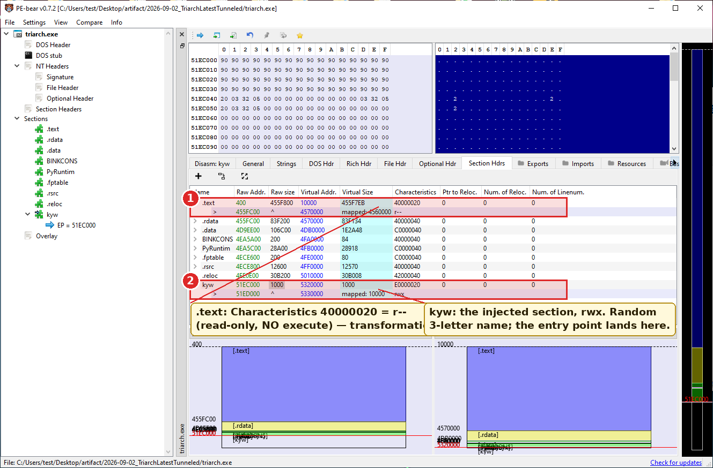

2. Pick **Optional Hdr → Data Directories**. Note the *Import Directory* RVA: it lies inside that last injected section, not in `.rdata`. Note the *Import Address Table* RVA: it lies at the start of `.rdata`, size `0xA20` (648 slots).

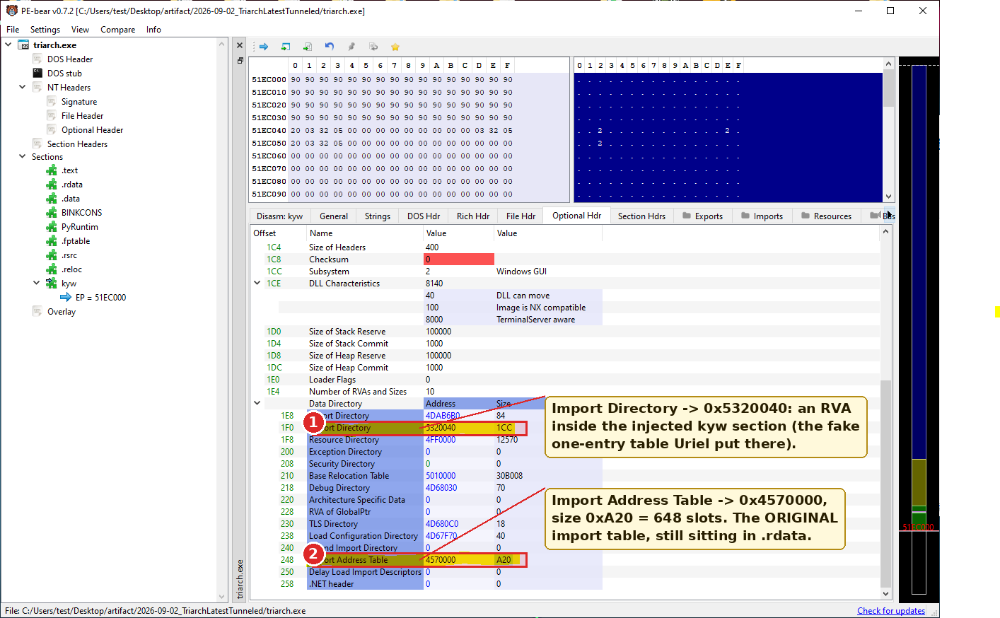

3. Run Detect It Easy on the file, click **Entropy**: `.text` reads close to 8.0 bits per byte and DiE flags it *packed*; the whole file reads *packed(97%)*.

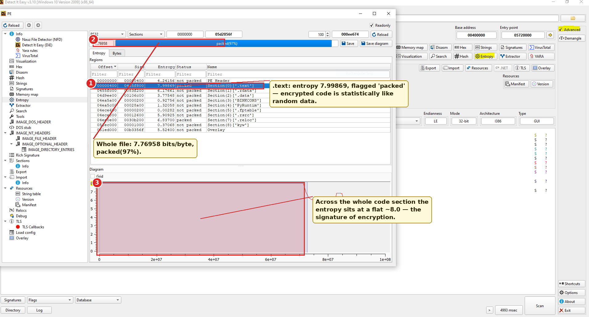

A normal code section of this compiler reads about 6.5 — open a rebuilt `triarch_clean.exe` the same way to compare:

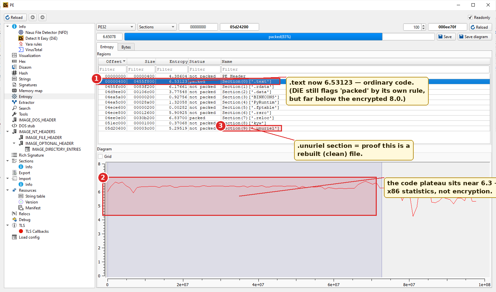

</details>

## Transformation 1: .text is XOR-encrypted with a tiled 4096-byte key

> **XOR keystream.** XOR (`^`) is a bitwise operation with one crucial property: `a ^ k ^ k == a`. If you XOR data with a key you get ciphertext; XOR the ciphertext with the same key and the data comes back. A *keystream* is a long sequence of key bytes applied position by position: `C[i] = P[i] ^ K[i]`.

The protector treats `.text` as a sequence of 4096-byte pages and XORs every page with the *same* 4096-byte key. Byte `j` of every page is XORed with `K[j]`. In the notation of the tool:

```
for i in range(len(text)):
    text[i] ^= key[i % 4096]
```

The key is different on every build (a new key is generated each time the developers run the protector), but within a build it is one fixed 4096-byte block. `.text` is about 68 MB, which is roughly 17,400 to 17,760 pages, so the same key is reused about seventeen thousand times. Document 02 explains why that is fatal to the scheme.

At runtime, the protector decrypts pages lazily — a page is only put back into the clear when the program is about to execute it. That is what transformation 2 is for.

<details>
<summary><strong>[Expand] See it yourself — the key repeats every 4096 bytes</strong></summary>

1. Open `triarch.exe` in HxD. Go to offset `0x400` (page 0 of `.text`) and then to `0x1400` (page 1). They look like noise — but noise that *rhymes*: the same bytes recur at the same position within each page far more often than chance allows.

   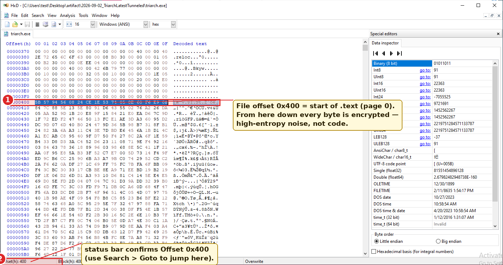

2. Make it visible with two lines of Python:
   ```python
   d = open('triarch.exe','rb').read(); a, b = d[0x400:0x1400], d[0x1400:0x2400]
   print(sum(x == y for x, y in zip(a, b)), 'of 4096 bytes identical between page 0 and page 1')
   ```
   Two random pages share about 16 bytes (4096/256). Page 0 and page 1 of the protected `.text` share **140** — because two pages XORed with the *same* key stay equal wherever the underlying code bytes were equal, and x86 code is full of zeros.
3. Run `python tools/ksattack.py triarch.exe` and watch the key fall out of the histogram in a few seconds — 17,759 pages sampled, **0 offsets with a weak mode**, and the recovered key written to `keystream.bin`.

   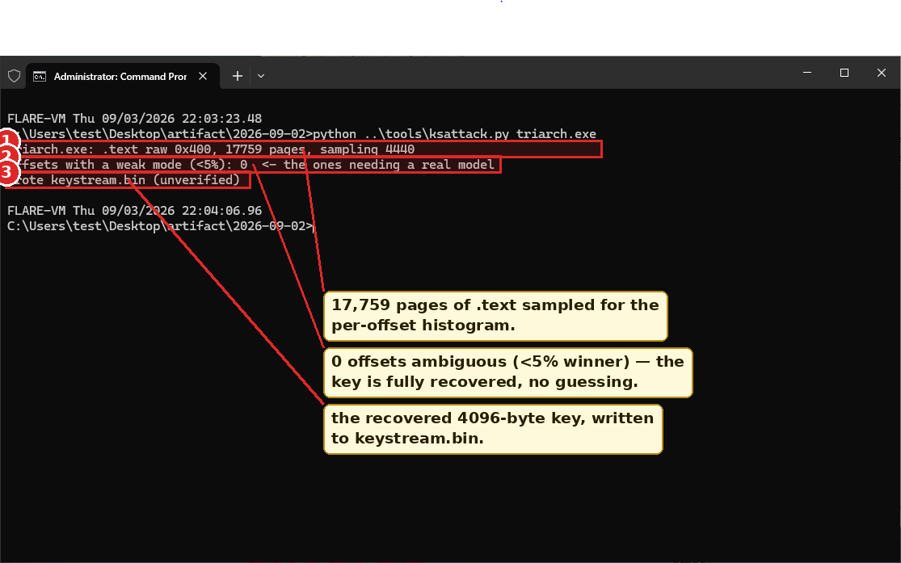

</details>

## Transformation 2: .text loses its execute permission

> **Section characteristics** are a 32-bit flag word per section. The three that matter here are `IMAGE_SCN_MEM_READ` (0x40000000), `IMAGE_SCN_MEM_WRITE` (0x80000000) and `IMAGE_SCN_MEM_EXECUTE` (0x20000000). When Windows maps the file into memory, it turns these into page protections: a section with READ but not EXECUTE becomes `PAGE_READONLY`, and the CPU will raise an exception if anything tries to execute code from it.

The protected `.text` has `IMAGE_SCN_MEM_EXECUTE` cleared. On its own that would make the program crash instantly at its first instruction. The protector avoids that with a **vectored exception handler**:

> **VEH (Vectored Exception Handler).** Windows lets a program register a function (via `AddVectoredExceptionHandler`) that gets the first look at every hardware exception in the process, before any `try/catch` frames. A handler can inspect the fault, fix something up, and return `EXCEPTION_CONTINUE_EXECUTION` to make the CPU retry the faulting instruction as if nothing had happened.

So the runtime sequence for any page of game code is:

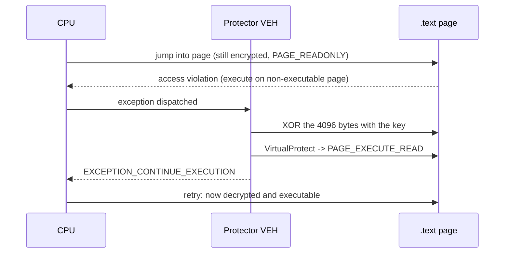

Two consequences follow. First, a page that is never executed is never decrypted — sitting at the login screen leaves most of the 68 MB scrambled in memory. Second, if you dump the process, you get a patchwork: cleartext where the game has been, ciphertext everywhere else. Both of these shaped the first unpacking attempts (see "The first assumption" below).

<details>
<summary><strong>[Expand] See it yourself — the missing execute flag</strong></summary>

1. In PE-bear, **Section Hdrs**, look at the *Characteristics* column for `.text`. Its flags decode to *code*, *readable* — and **no** *executable*: PE-bear even annotates the row `r--`. The injected `kyw` section, by contrast, is `rwx`. Compare with `triarch_clean.exe` after the rebuild, where the `IMAGE_SCN_MEM_EXECUTE` bit is back on `.text`.

   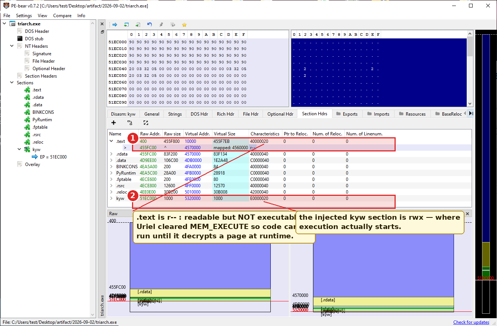

2. With the protected client running, open it in System Informer → **Memory** tab, sort by address, and scroll through the `.text` range (`0x410000` upward if the image loaded at its preferred base: `.text` has VirtualAddress `0x10000` and the base is `0x400000`). Pages that have been executed show `RX`; pages that have not are still `R` only. Move around in the game and refresh: more pages turn `RX`. That is the lazy, per-page decryption at work. (This step needs the protected client running on a physical machine — its anti-cheat refuses to run under a VM or with an analysis tool attached.)

   *[Screenshot 01-C runtime view goes here — file `images/01-C-sysinformer-text-protections.png`: System Informer Memory tab of the running protected client, a mix of R and RX 4 KB regions inside the .text range. See [images/README.md](images/README.md).]*

</details>

## Transformation 3: the import directory is replaced

This one needs the most background, because it is where the protector's shortcut lives.

> **Imports.** A Windows program calls functions in system DLLs (`CreateFileW` in `KERNEL32.dll`, `send` in `WS2_32.dll`, ...). It does not know their addresses at build time, so the linker leaves a table of pointer-sized *slots* in the file and the loader fills them in when the program starts. Compiled code calls through the slot: `call dword ptr [slot]`.
>
> **IAT (Import Address Table)** is that array of slots. On disk each slot holds an RVA pointing at a small *hint/name entry* — a 16-bit "hint" (an optimisation for the loader: the function's expected position in the DLL's export table) followed by the function's name as a NUL-terminated string. After loading, each slot holds the real address of the function. Slots for one DLL are contiguous and end with a zero slot as terminator. A slot whose top bit is set (`0x80000000 | n`) means "import ordinal `n`" — a function identified by number rather than name.
>
> **Import descriptors** (the *import directory*, data directory 1) are 20-byte records, one per DLL, that tell the loader: the DLL's name, where its thunk array starts (`FirstThunk`, an RVA into the IAT) and where the parallel array of name pointers starts (`OriginalFirstThunk`). Without a descriptor the loader does not know a DLL exists, even if its IAT slots are still there.

The Microsoft linker writes descriptors sorted by DLL name and lays the IAT out in the same order, one NUL-terminated run per DLL.

What Uriel does:

1. **Replaces the import directory** with one descriptor: `client_x86.dll`, importing a single function. The loader therefore loads the protector's DLL and nothing else. (The game itself needs KERNEL32, USER32, WS2_32 and nineteen others; the protector resolves those by hand at runtime and writes the addresses into the original slots.)
2. **Leaves the original IAT in place** in `.rdata`. On every build measured, the IAT data directory still points to a 0xA20-byte table: 648 slots, of which 626 are imports and 22 are the zero terminators that separate DLL runs. Thirty-four of the 626 are ordinal imports.
3. **Leaves the original hint/name entries in place**, but obfuscates them. Each name is XORed byte by byte with the *first bytes of the same 4096-byte keystream* used on `.text`: `name[i] ^= key[i]`. The 16-bit "hint" word in front of each name is repurposed to hold the **length** of the name, because the NUL terminator can no longer be trusted (if a plaintext byte equals its key byte, the ciphertext byte is zero).

The result, viewed with any ordinary PE tool, is an executable that imports exactly one function from `client_x86.dll` and nothing else. Viewed with a hex editor, `.rdata` still contains 626 slots pointing at short strings that look like garbage but have suspiciously reasonable lengths.

The single function the game calls in the protector's DLL is named `FireInTheHole`. It is the one legitimate connection between the game and the anti-cheat, and document 02 explains what the unpacker does with it.

<details>
<summary><strong>[Expand] See it yourself — one fake import, and the real table still on disk</strong></summary>

1. PE-bear → **Imports**. One DLL: `client_x86.dll`, one function: `FireInTheHole`. That is all the loader will bind.

   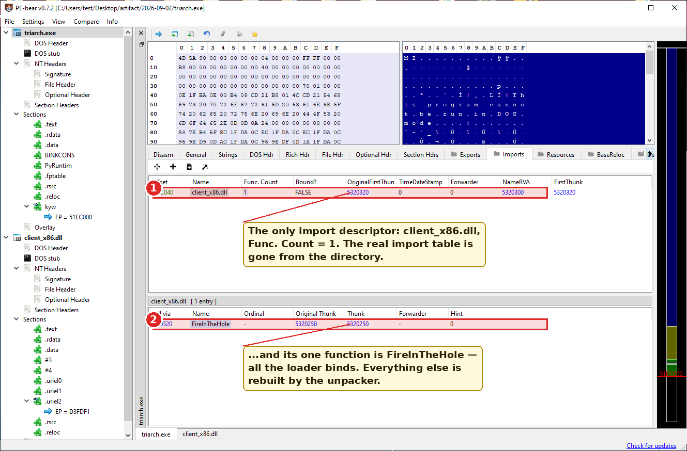

2. Now go to **Optional Hdr → Data Directories → IAT** and jump the hex view to that RVA (in PE-bear, clicking the `.rdata` section node lands you at the start of the IAT). You see 648 little-endian DWORDs. Most are RVAs pointing a little further into `.rdata`; a few are `0x8000xxxx` (imports by ordinal); 22 are zero (group separators).

   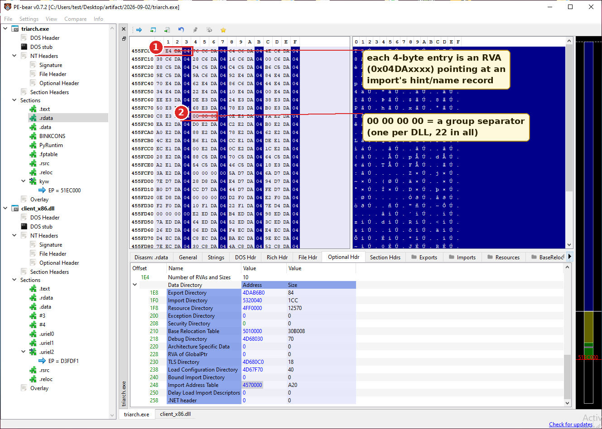

3. Follow one of those RVAs (PE-bear: right-click → *follow RVA*, or convert to a file offset yourself). You land on a 16-bit word followed by that many bytes of apparent garbage and a `00`. The word is the *length* of the function name; the garbage is the name XORed with the first bytes of the same key you recovered above.

</details>

## Transformation 4: the entry point is redirected

> **Entry point.** `AddressOfEntryPoint` in the optional header is the RVA of the first instruction the loader jumps to. In a Microsoft C++ program it is not `main`; it is a small CRT (C runtime) startup function that initialises the runtime and then calls `main` or `WinMain`.
>
> **The CRT entry's shape.** With recent Microsoft toolchains that function is tiny and always the same: `call __security_init_cookie` followed by `jmp __scrt_common_main_seh`. Ten bytes: `E8 rel32 E9 rel32`. Document 02 uses this shape to find the original entry point after decryption.

Uriel adds a new section with a random three-letter name — on the eight builds measured: `ywu`, `tmi`, `vam`, `bwz`, `szn`, `rgp`, `pll`, `kyw` — marked readable, writable and executable, and points `AddressOfEntryPoint` into it. On disk the section is a **NOP sled**: a long run of `0x90` (`nop`, "do nothing") instructions. That is not what runs. `client_x86.dll` is loaded first (because it is the only import), its `DllMain` runs, and it patches the sled in memory so that execution flows into the protector's own initialisation and eventually to the real CRT entry inside `.text`.

The original `AddressOfEntryPoint` is not stored anywhere in the file. It has to be rediscovered.

<details>
<summary><strong>[Expand] See it yourself — the entry point in the injected section</strong></summary>

1. PE-bear → **Optional Hdr**: *Entry Point* is `0x5320000`, while *Base of Code* is `0x10000` (that is `.text`). So execution starts outside `.text` — at the RVA of the injected `kyw` section, not in the game's code.

   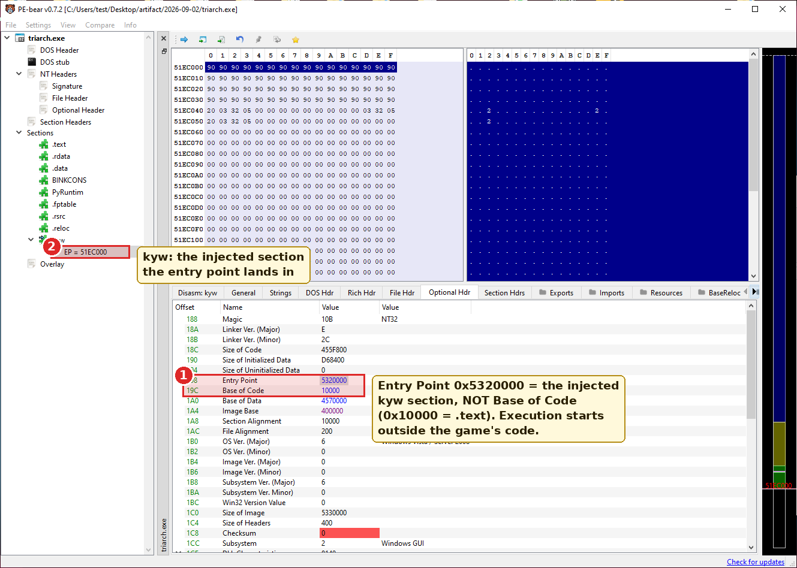

2. Click the `kyw` node and switch to the **Disasm** tab: the entry is a long run of `90` bytes, each disassembling as `NOP`. Nothing meaningful is there on disk; the protector writes a jump into this sled at runtime.

   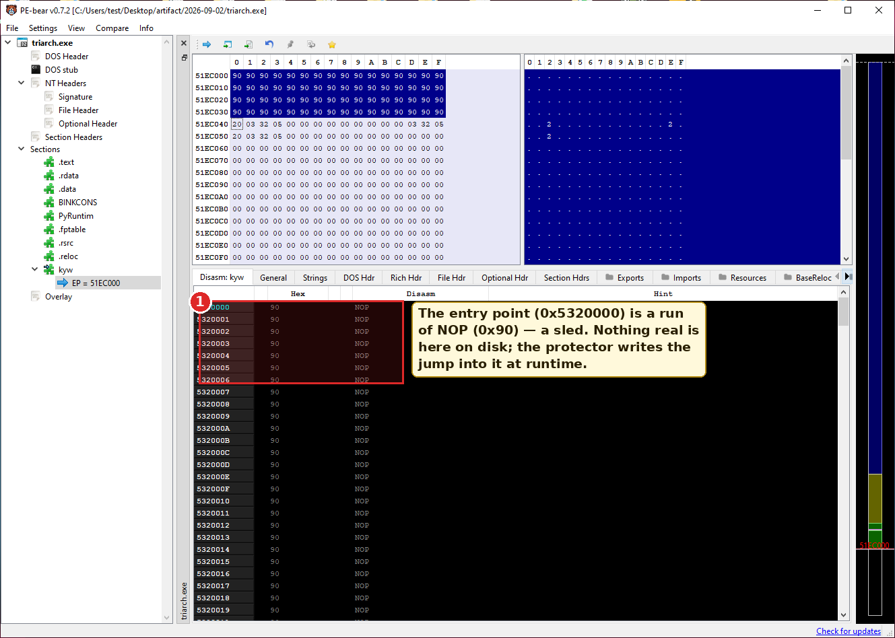

3. For contrast, open a rebuilt `triarch_clean.exe`. Its *Entry Point* is now `0x44DABE1`, deep inside `.text` (and *DllCharacteristics* has lost the dynamic-base bit — ASLR off).

   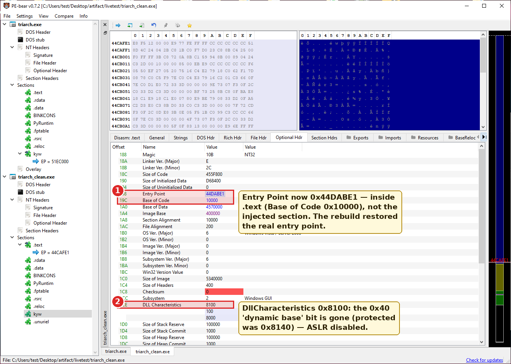

4. The Disasm at that address is the real thing: `CALL` immediately followed by `JMP`, then `CC` (int3) padding — the MSVC C-runtime start-up (`call __security_init_cookie; jmp __scrt_common_main_seh`) that document 02 uses to find the original entry point behind the sled.

   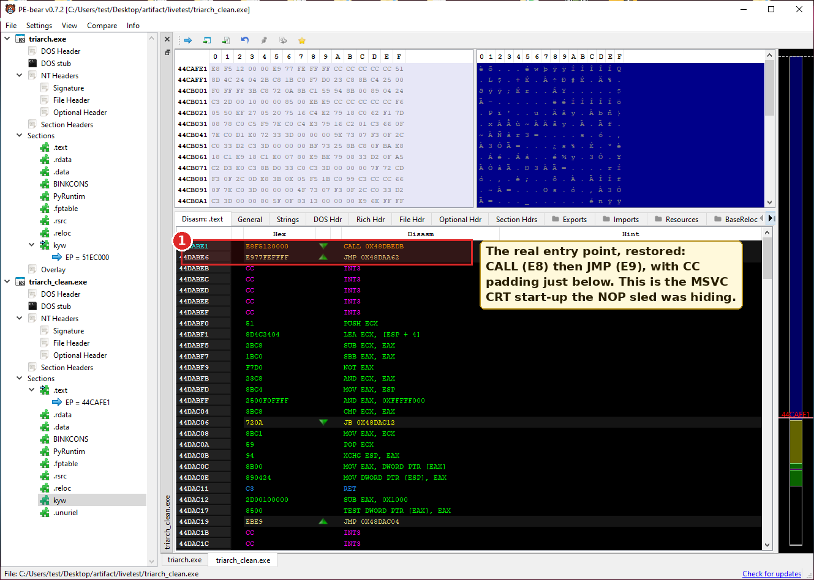

</details>

## How each transformation was discovered

None of the above was documented anywhere. Here is the order in which the observations were made and what made each one visible. This is the part worth internalising: the techniques are generic.

**Look at the section table first.** Any PE parser (`tools/unuriel.py` contains one in about 40 lines, class `PE`) lists sections, sizes and characteristics. Two things stood out immediately:

- `.text` was missing `IMAGE_SCN_MEM_EXECUTE`. A linker always marks a code section executable (the usual value is `0x60000020`: code, execute, read). A code section that is not executable cannot run unless something fixes it up at runtime. That pointed at a runtime component.
- There was an extra section with a nonsense name, marked readable, writable *and* executable, and `AddressOfEntryPoint` pointed into it. Transformation 4.

**Look where the data directories point.** The import directory RVA (data directory 1) was inside the injected section, not in `.rdata` where the linker puts it. Whatever was there was written by the protector, not the linker. Reading it showed one descriptor: `client_x86.dll`. Meanwhile the IAT directory (data directory 12) still pointed into `.rdata`, at a 0xA20-byte table. That table was not zeroed. Following its slots led to short blobs in `.rdata`, each prefixed with a 16-bit word holding a small number — the length of a plausible API name, never more than 52 on any build — followed by that many bytes of non-ASCII junk, then a zero. Real hint/name entries with the names scrambled. Transformation 3.

**Compare the file with memory.** Attach a debugger to the running game, or read its memory with `ReadProcessMemory`, and compare `.text` against the bytes on disk. Pages the game had executed differed from the file; pages it had not executed were identical to the file. XORing a differing page against its on-disk counterpart gave a 4096-byte block; doing the same for a second page gave the *same* block. One key, tiled per page. Transformation 1.

**Watch the page protections.** `VirtualQueryEx` over the `.text` range of a live process shows a mix of `PAGE_READONLY` and `PAGE_EXECUTE_READ` regions, with the executable ones growing as the game is used. Combined with the cleared section flag, that is a lazy per-page decrypt driven by execute faults. Transformation 2.

**Notice what the names' lengths and first bytes have in common.** XORing the first obfuscated name against a guessed plaintext — the game obviously imports `GetProcAddress`-class functions — produced the same bytes as the beginning of the `.text` keystream. The import name key *is* `key[0:len]`. Nothing new to recover.

<details>
<summary><strong>[Expand] See it yourself — file versus memory</strong></summary>

1. Start the protected client and attach x32dbg (*File → Attach*). Open the **Memory Map**: the image, its sections, and the DLLs — `client_x86.dll` is there, loaded before anything the game needs.
2. In the **CPU** view, go to an address in `.text` that has already run (the entry of any function the game is currently executing — pause the debugger and look where it stopped). Readable x86. Then `Ctrl+G` to an address a few megabytes away that nothing has touched yet: PE-bear-style noise, and the page is not executable.
3. This is the whole "decrypted lazily, page by page" observation, made without reading a single instruction of the protector.

*[Screenshot 01-F goes here — file `images/01-F-x32dbg-memory-map.png`: x32dbg attached to the running client: Memory Map with client_x86.dll listed, and the CPU view showing decrypted code at a hot address. See [images/README.md](images/README.md).]*

</details>

## The first assumption, and how it was overturned

The natural first conclusion from all this was: **the game must be run to decrypt it.** The key is only ever applied in memory, by the protector, page by page. So the first working unpacker did exactly that — it launched the client, waited until in-memory `.text` stopped matching the disk, read out every decrypted page, XORed each against its on-disk ciphertext, and took a majority vote per page offset to reconstruct the 4096-byte key. It also read the live IAT out of memory, after the protector had filled it in, and mapped each address back to a DLL export. That method survives as the `harvest` subcommand of `tools/unuriel.py` and as the `--live` mode of the patcher.

It worked, but it was slow, needed a Windows machine with the game installed, needed the operator to click around the client so enough pages would decrypt, and produced slightly wrong import names (document 02 explains why: addresses resolved through *forwarders* come back with a different DLL's name).

The assumption was wrong because of one word in transformation 1: **tiled**. A 4096-byte key reused across seventeen thousand pages of machine code is a *many-time pad*, and a many-time pad on highly non-uniform plaintext leaks its key from the ciphertext alone. `tools/ksattack.py` was written as a feasibility test of that idea; it recovered 4096 out of 4096 key bytes from the file with no game launch, on every build tried, in about three seconds. Once the key was known offline, the import names decoded offline, the entry point could be found offline in the decrypted code, and the live method became a fallback rather than the main path.

Document 02 walks through all of that with the code.

## Summary table

| Transformation | Where to see it | Undone by |
|---|---|---|
| `.text` XOR with one 4096-byte key per page | Byte-compare disk vs. memory; per-offset histogram of the file | `static_keystream()` — many-time-pad attack |
| `.text` not executable; VEH decrypts per page | Section characteristics; `VirtualQueryEx` on live process | `rebuild` sets `IMAGE_SCN_MEM_EXECUTE` |
| Import directory replaced; original IAT kept with XORed names, hint = length | Data directory 1 RVA inside injected section; IAT dir 12 still in `.rdata` | `decode_iat()` + `attribute_dlls()` + `tools/imports_db.json` |
| Entry point into injected NOP-sled section | Optional header; section table | `find_oep()` — CRT entry located by shape |
