# 02 — Unpacking offline

[01-how-uriel-protects-the-client.md](01-how-uriel-protects-the-client.md) described four transformations the protector applies to `triarch.exe`. This document works through `tools/unuriel.py`, the program that reverses all four using nothing but the file on disk. Read it with the source open; every section names the function it is describing.

The two commands that matter:

```
python tools/unuriel.py derive  triarch.exe -o profile.json
python tools/unuriel.py rebuild triarch.exe profile.json -o triarch_clean.exe --stub-dll uriel_stub
```

`derive` writes a JSON *profile* (key, imports, entry point). `rebuild` applies it. The split exists so that a profile can be inspected, diffed against another build, or cross-checked against a live harvest before anything is written.

## Contents

- [1. Recovering the key: the many-time-pad attack](#1-recovering-the-key-the-many-time-pad-attack)
- [2. Decoding the import names](#2-decoding-the-import-names)
- [3. Groups, and which DLL each one belongs to](#3-groups-and-which-dll-each-one-belongs-to)
- [4. Finding the original entry point by shape](#4-finding-the-original-entry-point-by-shape)
- [5. Rebuild: writing a clean executable](#5-rebuild-writing-a-clean-executable)
- [6. The live method, kept as a fallback](#6-the-live-method-kept-as-a-fallback)
- [7. Verification](#7-verification)
- [CLI reference](#cli-reference)
- [Exercises for the reader](#exercises-for-the-reader)

## 1. Recovering the key: the many-time-pad attack

Function: `static_keystream(raw, pe, sample=2500)`. Feasibility test: `tools/ksattack.py`.

### Why a reused key is recoverable

> **One-time pad.** XORing plaintext with a truly random key that is as long as the message and never reused is unbreakable: any plaintext is equally consistent with the ciphertext. **Many-time pad** is what you get when the key is shorter than the message and repeats. It is not merely weak — with enough ciphertext and any structure at all in the plaintext, the key falls out directly.

The protector's `.text` encryption is `C[i] = P[i] ^ K[i mod 4096]`. Fix a page offset `j` and look at that one byte across every page:

```
page 0:    C_0[j]    = P_0[j]    ^ K[j]
page 1:    C_1[j]    = P_1[j]    ^ K[j]
...
page 17k:  C_17k[j]  = P_17k[j]  ^ K[j]
```

Seventeen thousand different plaintext bytes, all XORed with the *same* unknown `K[j]`. If the plaintext bytes were uniformly random, the ciphertext bytes would be too and nothing could be learned. But the plaintext is x86 machine code, and x86 code is nothing like uniform:

- `0x00` is by far the most common byte, roughly one byte in eight. It appears in every 32-bit immediate or displacement that is small (`mov eax, 5` is `B8 05 00 00 00`), in every `[reg+0]`-style encoding, in aligned tables, and in the zero bytes of many addresses.
- `0xCC` (`int 3`) is what the Microsoft linker fills between functions, so it comes in runs at function boundaries.

If `P[j]` is `0x00` on one page in eight, then `C[j]` equals `K[j] ^ 0x00 = K[j]` on one page in eight. No other single value of `P[j]` is anywhere near that frequent. So the **most common ciphertext byte at offset `j` is `K[j]` itself.** No crib, no known plaintext, no guessing.

### A tiny illustration

```python
import collections

PAGE = 4096

def recover_key(text_bytes, pages):
    key = bytearray(PAGE)
    for j in range(PAGE):
        counts = collections.Counter(text_bytes[p * PAGE + j] for p in pages)
        key[j] = counts.most_common(1)[0][0]      # the mode IS the key byte
    return bytes(key)
```

That is essentially the whole of `static_keystream()`. The real function also samples: with `sample=2500` it takes every `total // 2500`-th page rather than all 17,000, because 2,500 votes per offset is already a landslide, and it counts *weak* offsets — those where the winning byte got fewer than one vote in twenty. That count is a diagnostic, not a correction; `derive` refuses to continue if more than 64 offsets are weak, on the theory that the file is not what we think it is.

`tools/ksattack.py` is the original feasibility test and is worth running once. Given the encrypted exe and a known-good decrypted one it scores the recovery against ground truth, and additionally checks the assumption that the key is constant across pages (`K = C ^ P` must be the same 4096 bytes on every page it samples).

### Measured result

Measured: on the builds where a live harvest existed to compare against, the static key matched it **byte for byte (4096/4096)**; on all eight builds the recovery reported **0 weak offsets** and took about 3 seconds, and every downstream check (626 decoded names all valid identifiers, entry point found, every offset resolver satisfied) passed. The margins are not close. The distribution of x86 bytes is so lopsided that even the `0xCC` fallback that `ksattack.py` allows for ("was the mode actually `0xCC` rather than `0x00`?") was never needed.

### Seeing the attack

The figures below are drawn from a real protected build (17,695 pages of
`.text`) by `tools/attack_figures.py`, with nothing retouched; run it on
your own copy and you get the same pictures with your build's numbers. Read them in
order; each one answers the question the previous one raises.

**1. The same key byte lands in the same column of every page.** Stack the
pages as rows and the first 24 bytes as columns. Every cell in column `j`
was produced as `P[page][j] XOR K[j]`, so the whole column shares one key
byte. The rows look like noise, but look *down* a column: the same values
keep coming back (red boxes). Those are the pages whose plaintext byte at
that offset was `0x00`, and `0x00 XOR K[j]` is simply `K[j]`. Counting the
most common value in each column over all 17,695 pages gives the bottom
row: the key. The share of pages agreeing is only 11–13 %, and that is
enough, because no other value comes close.

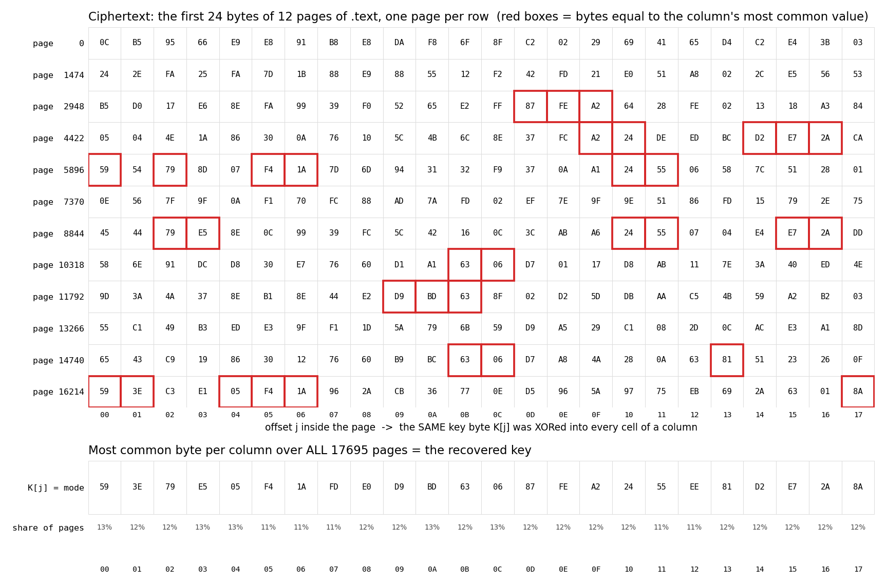

**2. What one column looks like as a histogram.** Take offset `j = 7` and
count how often each of the 256 byte values appears there across all
pages. Left: the ciphertext. One value stands far above the rest, and it is
`K[7]`. Right: the same column after XORing every cell with `K[7]`, which
turns it back into plaintext. The spike moves to `0x00`; the remaining bars are
ordinary instruction bytes (`0xFF`, `0x8B`, `0x83`, and `0xCC`, the `int3`
byte MSVC pads between functions with). The
ciphertext histogram is the plaintext histogram *relabelled* by the XOR;
relabelling cannot hide which bar is tallest.

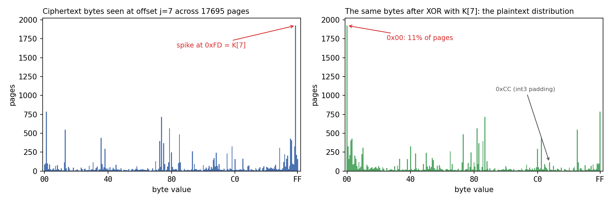

**3. It is never a close call.** For each of the 4096 key positions, plot
the share of pages that voted for the winning byte and the share that
voted for the runner-up. The winner never drops below about 10.5 %, the
runner-up never rises above about 6.8 %, and the two lines never touch.
That gap is the whole reason the recovery is exact: the vote at every
single position is decided by a margin that thousands of pages cannot
blur. (`derive` reports positions where the winner has under 5 % as
"weak"; on every build examined there were none.)

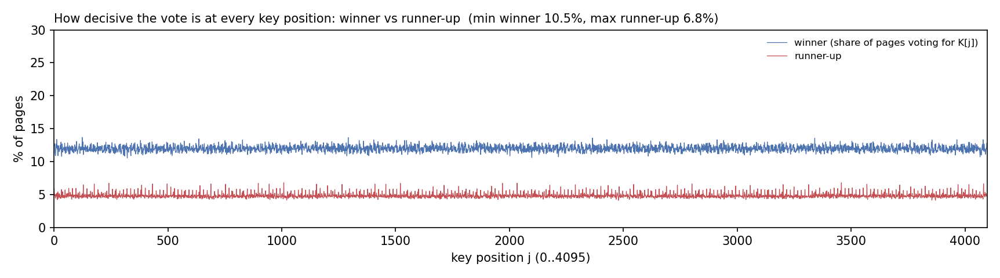

**4. The key looks random. The plaintext does not.** Render a 4096-byte
block as a 64×64 grey image (black = `0x00`). The ciphertext page and the
key are featureless static, as a good stream cipher output should be. XOR
them and the plaintext page appears with the streaky, zero-heavy texture
of x86 code: short instructions, small immediates, aligned tables. The
weakness was never the key; it was reusing it 17,695 times.

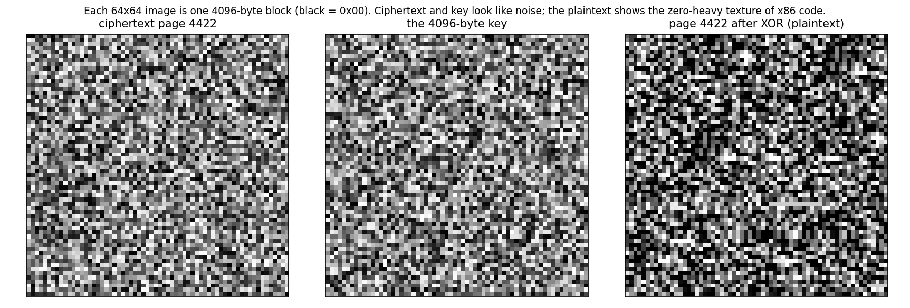

**5. The hexdump you can check by hand.** Page 0 of `.text` before and
after. The decrypted page opens with `55 8B EC` — `push ebp; mov ebp, esp`,
the prologue MSVC emits for almost every function — and is peppered with
`00` bytes. (This and every other byte pattern these documents quote are
collected in one table in the [glossary](08-glossary.md#x86-byte-patterns-used-in-this-repo).) If you disassemble the bottom dump you get a real function; if
you disassemble the top one you get nonsense that faults on the second
instruction. That is the same test the OEP finder and the offset resolvers
rely on later: decrypted code *looks like code*.

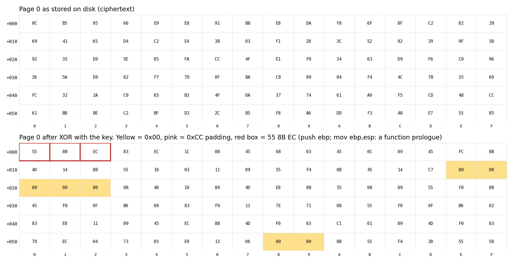

Why a *prediction* is possible at all deserves one more sentence. Nothing
about the key was guessed: the attack predicts that the most frequent
plaintext byte at any offset of a large body of x86 code is `0x00`, which
is a fact about compilers, not about this game. Measured on the recovered
plaintext, `0x00` is 10.9 % of all bytes at the offset in figure 2 and
about 11–12 % overall; the next most common byte is under 7 %. Any
protector that XORs a repeated key over code hands that statistic straight
to the attacker.

<details>
<summary><strong>[Expand] See it yourself — recover the key on your machine</strong></summary>

1. `python tools/ksattack.py triarch.exe` prints the number of pages sampled and how many offsets had a weak majority (expect 0). Pass a known-good `triarch_clean.exe` of the *same build* as a second argument and it also scores the recovery against ground truth (4096/4096).

   

2. The recovered key is written beside it as `keystream.bin` — no extra step needed. Open that in HxD: 4096 bytes that look random, because they are. The weakness was never the key; it was reusing it on every page.

   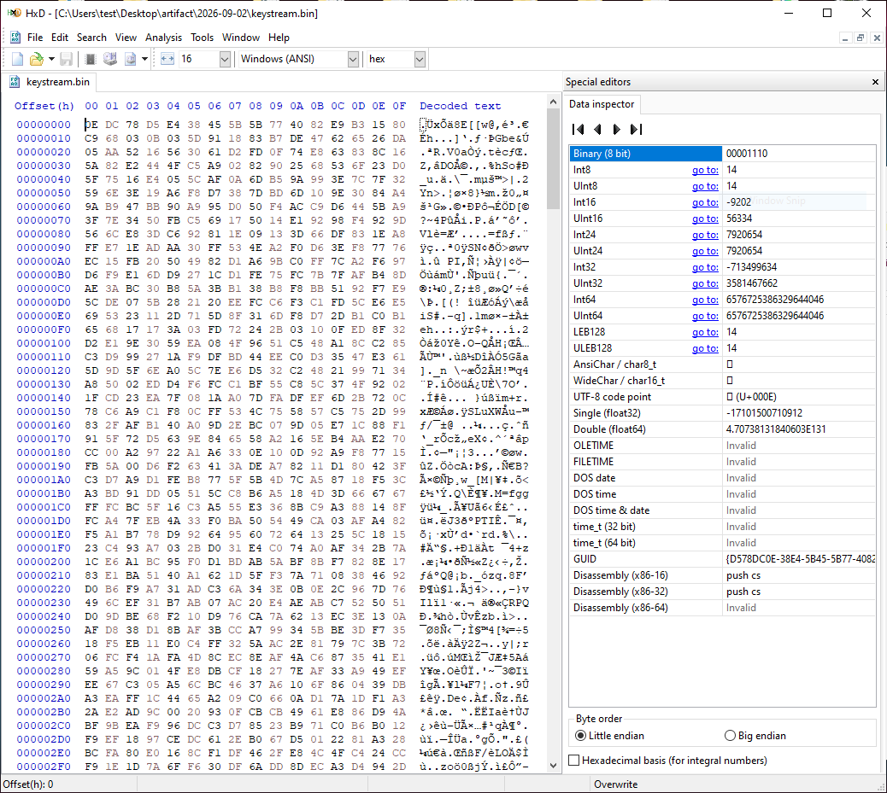

</details>

## 2. Decoding the import names

Function: `decode_iat(raw, pe, key)`.

The IAT data directory (index 12) still points at the original slot table in `.rdata`. `decode_iat` walks it four bytes at a time:

| Slot value | Meaning | What the function records |
|---|---|---|
| `0` | End of one DLL's run | Closes the current group, starts a new one |
| Top bit set (`0x8000xxxx`) | Import by ordinal `xxxx` | Name `"#n"` |
| Otherwise | RVA of a hint/name entry | Decoded name |

For a hint/name entry the decoding is:

```python
n      = struct.unpack_from("<H", raw, off)[0]       # the "hint" word: really the length
cipher = raw[off + 2 : off + 2 + n]
name   = bytes(b ^ key[k] for k, b in enumerate(cipher))
```

Two things to notice:

1. **The key for names is the beginning of the `.text` keystream.** `name[i] ^= key[i]`, with `i` starting at 0 for every name. Names are at most 52 characters on these builds, so only `key[0:52]` is ever used. Nothing extra to recover.
2. **Trust the length, not the NUL.** A normal hint/name entry ends at its first zero byte. Here, whenever a plaintext character happens to equal its key byte, the ciphertext byte is `0x00` in the middle of the name. Stopping at the first zero would truncate. The protector solved this for itself by writing the length into the otherwise-useless hint word, and the decoder does the same.

After decoding, `derive` sanity-checks every name against an identifier alphabet (`IDENT` in the source). If any decoded name contains a character outside `[A-Za-z0-9_@?$]`, the key is wrong and the run stops with "decoded import names are garbage". This is the cheapest possible end-to-end check on step 1: 626 short strings that all have to come out as valid C identifiers.

<details>
<summary><strong>[Expand] See it yourself — decode one import name by hand</strong></summary>

1. Take an IAT slot from the PE-bear hex view (document 01). The first dword at the start of `.rdata` is `0x04DAE454` — an RVA that points at a hint/name record.

   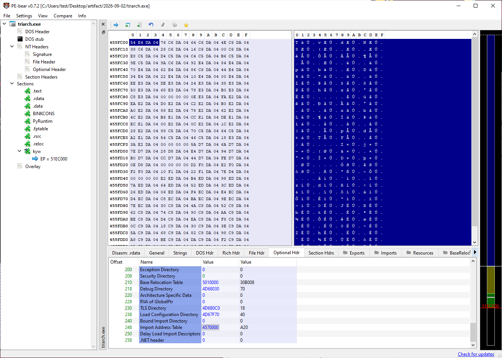

2. Convert that RVA to a file offset (subtract the `.rdata` RVA, add its raw pointer — here a shift of `-0x10400`, giving `0x4D9E054`) and decode it: a 16-bit length `n`, then `n` bytes XORed with `keystream.bin`.
   ```python
   import struct
   d = open('triarch.exe','rb').read(); k = open('keystream.bin','rb').read()
   off = 0x4D9E054                       # the hint/name entry the IAT slot points at
   n = struct.unpack_from('<H', d, off)[0]
   print(bytes(c ^ k[i] for i, c in enumerate(d[off+2:off+2+n])))
   ```
   A Windows API name appears — here `b'RegFlushKey'`.

   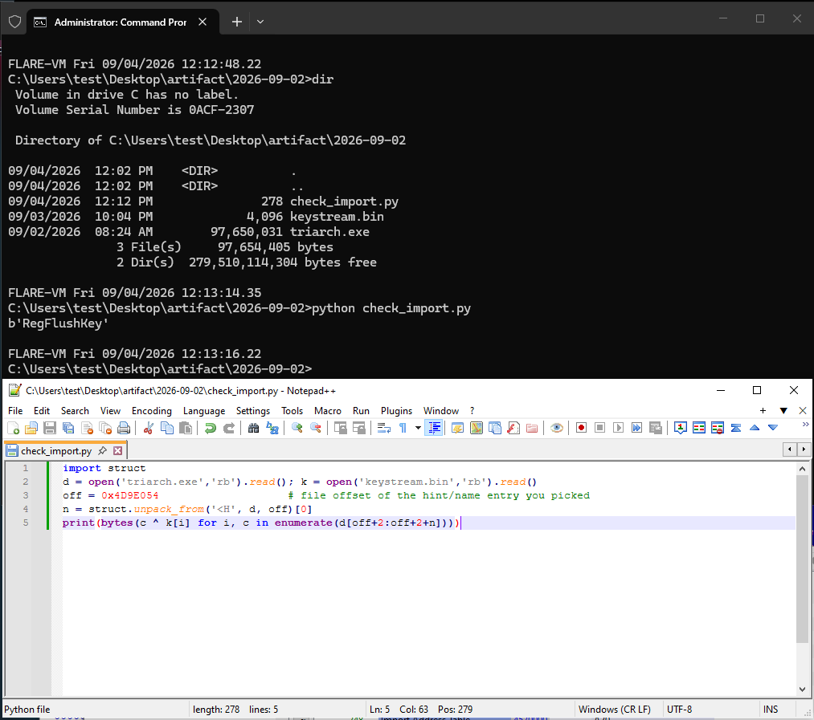

3. Run `python tools/unuriel.py derive triarch.exe -o profile.json` and open `profile.json`: the whole table decoded, every slot with the DLL it was attributed to — the one name you just did by hand, done for all 626.

   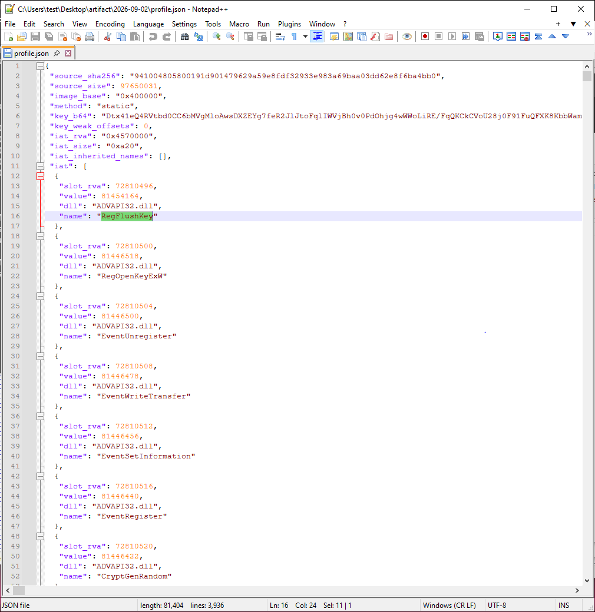

</details>

## 3. Groups, and which DLL each one belongs to

Function: `attribute_dlls(groups, db, log)`. Table: `tools/imports_db.json`.

### What survived and what did not

The linker writes the IAT as one NUL-terminated run per DLL, in the same order as the import descriptors, which it sorts by DLL name. Uriel left those runs and their terminators exactly as written. On every build: **22 groups, 626 imports, 34 by ordinal**, in a 0xA20-byte table (648 slots = 626 + 22 terminators).

What did *not* survive is the import descriptors — the records that say "this run belongs to `KERNEL32.dll`". Every group has a fully decoded list of function names, and no DLL name. That is the one piece of information the file genuinely no longer contains.

### The lookup table

`tools/imports_db.json` maps function name to DLL:

```json
{
  "names":    { "CloseHandle": "KERNEL32.dll", "BitBlt": "GDI32.dll", ... },
  "ordinals": { "WS2_32.dll": { "1": "accept", "2": "bind", ... }, "OLEAUT32.dll": { "6": "SysFreeString" } }
}
```

It was generated once, from a live harvest (section 6): the harvest resolves each slot's runtime address to a DLL, and the DLL that wins the majority in a group is recorded against every name decoded from the on-disk table for that group. The names in the table are therefore the *original* strings the linker wrote, not the names the harvest resolved.

### Attribution rules

`attribute_dlls` works group by group:

1. **Any recognised name settles the whole group.** A group is one DLL by construction, so it votes: each name known to `names` casts a vote for its DLL and the majority wins. Names in the group that the table has never seen simply **inherit** the group's DLL. `derive` reports these as "inherited" so a new build that adds imports is visible in the log.
2. **Ordinal-only groups** (no names at all) are matched against `ordinals`: every DLL whose ordinal table contains *all* the group's ordinals is a candidate.
3. **Ties are broken by the linker's ordering.** Descriptors are sorted by DLL name, so a group's DLL must sort *between* its neighbours' DLLs. The concrete case: a group containing only ordinal `#6` fits both `OLEAUT32.dll` (`#6` = `SysFreeString`) and `WS2_32.dll` (`#6` = `getsockname`). Whichever of the two sorts between the previous group's DLL and the next group's DLL is the answer; the other is rejected.
4. **Last resorts** for a group with names the table has never seen and no known neighbour: a prefix table (`PREFIX_DLL`: `Reg*` → ADVAPI32, `WinHttp*` → WINHTTP, ...) and, on Windows only, actually calling `GetProcAddress` against a list of candidate DLLs.

If any import still has no DLL after all that, `derive` stops and tells you to regenerate the table with a live harvest.

### Why disk beats live for the names

The live harvest resolves an *address* back to an *export*. That is lossy in three ways, all seen in practice:

| Original import (from disk) | What the live harvest reported | Why |
|---|---|---|
| `KERNEL32!HeapAlloc` | `ntdll!RtlAllocateHeap` | `HeapAlloc` is a **forwarder** — KERNEL32's export table says "see ntdll", so the address that lands in the slot belongs to ntdll |
| `KERNEL32!lstrlenA` | `KERNEL32!lstrlen` | Two export names for one address; the harvest picks whichever it saw first |
| `WS2_32!ntohl` and `WS2_32!htonl` | the same name for both | On a little-endian machine the two functions are identical code at one address |

A rebuilt executable that imports `RtlAllocateHeap` from ntdll runs fine, but it is not what the game was built with, and any later tool that looks for an IAT slot by name (`tools/mkoffsets.py` does exactly this) would miss. The names decoded from the on-disk hint/name entries are the linker's own, so they are what `derive` uses. The harvest's only remaining job for imports is to say which DLL a group came from, and that is captured once in the JSON table.

<details>
<summary><strong>[Expand] See it yourself — the 22 groups in the derive output</strong></summary>

1. Look at the group table `derive` prints: one line per DLL with its import count and first name. Compare the order with `imports_db.json` — uppercase DLL names first, lowercase after — the linker's sort order, which is what breaks the OLEAUT32/WS2_32 tie (the `group 5: ordinal-only … -> OLEAUT32.dll` line).

   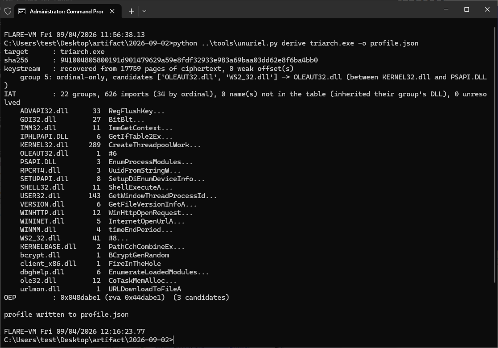

2. Open `profile.json` and search for `"value": 0` — exactly 22 hits, the group separators.

</details>

## 4. Finding the original entry point by shape

Function: `find_oep(pe, text_bytes)`.

With `.text` decrypted, the original entry point is somewhere in 68 MB of code with nothing pointing at it. It is found by *shape*.

> **CRT startup shape.** Programs built with recent Microsoft toolchains start in a function generated by the C runtime, not by the programmer. It is exactly two instructions: `call __security_init_cookie` then `jmp __scrt_common_main_seh`. `__security_init_cookie` initialises the stack-protector value (`__security_cookie`, a global whose address the linker records in the **load config directory**, data directory 10). `__scrt_common_main_seh` does the rest of the runtime initialisation and eventually calls `main`/`WinMain`.

The finder scans the decrypted text for every 10-byte window that satisfies all of the following:

| Test | Reason |
|---|---|
| Byte pattern `E8 rel32 E9 rel32` | `call` followed immediately by `jmp` — the two-instruction body |
| Preceded by `0xCC` | Functions are separated by `int 3` padding, so the entry starts right after one |
| Both targets land inside `.text` | Rules out garbage that happens to look like `E8 .. E9 ..` |
| **The window's own address is never a call or jump target** | The entry point is reached from the loader, not from code — nothing in the program calls it |
| The `call` target is called **exactly once** | `__security_init_cookie` is called from the entry and nowhere else |

Candidates are then scored. Ten points if the callee contains the single `mov [__security_cookie], ecx` store (`89 0D imm32`, where `imm32` is the address of `__security_cookie`, read from the `SecurityCookie` field of `IMAGE_LOAD_CONFIG_DIRECTORY32` — at `+0x3C` inside that structure, which the load config data directory points at; the same number as `e_lfanew` in document 01, by coincidence), one point if the `jmp` target is never *called* (only jumped to). On every build measured the finder produced 3 candidates and the highest-scoring one was the correct entry — confirmed byte-for-byte on the builds that had a known-good reference (section 7).

To build the "is this address ever a target" and "how many times is this called" sets, the finder makes one pass over all of `.text` decoding every `E8`/`E9` relative displacement. That is a crude disassembly — it will also pick up `E8` bytes that are data — but it errs on the side of *more* targets, which only makes the "never a target" test stricter, never looser.

<details>
<summary><strong>[Expand] See it yourself — the CRT entry shape</strong></summary>

1. After `rebuild`, open `triarch_clean.exe` in PE-bear → **Optional Hdr** → *Entry Point*, then **Disasm** at that RVA: `E8 xx xx xx xx` (call) immediately followed by `E9 xx xx xx xx` (jmp), with `CC` padding just before it. This is the same restored entry shown for transformation 4 in document 01:

   

2. In Ghidra, import `triarch_clean.exe`, let auto-analysis run, and go to the entry point: Ghidra names the two targets `__security_init_cookie`-like and `__scrt_common_main_seh`-like from their shape as well.

</details>

## 5. Rebuild: writing a clean executable

Function: `rebuild(args)`. It refuses to run if the profile's `source_sha256` does not match the input file (override with `--force`), then performs eight numbered steps, each of which prints a line:

**[1] Decrypt `.text`.** XOR every byte of the section's raw data with `key[i % 4096]`.

**[2] Restore execute permission.** OR `IMAGE_SCN_MEM_EXECUTE | IMAGE_SCN_MEM_READ` into the `.text` characteristics. The VEH trick is now unnecessary; there is no protector to perform it anyway.

**[3] Clear the ASLR bit.**

> **ASLR (Address Space Layout Randomisation).** If `IMAGE_DLLCHARACTERISTICS_DYNAMIC_BASE` (0x0040) is set in `DllCharacteristics`, Windows may load the image at a random base instead of its preferred `ImageBase`, applying the base relocations (data directory 5) to fix every absolute address. Clearing the bit makes the loader use `ImageBase` every time.

With ASLR off, an address you read in the file is the address you see in a debugger is the address a hook DLL can use. Every address the rest of this project computes (`tools/mkoffsets.py`) is an absolute virtual address for exactly this reason.

**[4] Group the profile's IAT into runs.** Consecutive slots with the same DLL become one descriptor. The protector's DLL (`client_x86`) is dropped — unless `--stub-dll NAME` is given, in which case its run is kept but relabelled `NAME.dll`. The patcher always passes `--stub-dll uriel_stub`: the game makes one call into the anti-cheat, `FireInTheHole`, and this makes that call land in `stub/uriel_stub.dll`, a replacement that returns a harmless object and gives the mod host a foothold in the process.

**[5] Lay out a new section, `.unuriel`.** It holds: fresh import descriptors (20 bytes each, plus a zero terminator); one `OriginalFirstThunk` array per descriptor, pointing at new hint/name entries with the decoded names — or `0x80000000 | ordinal` thunks where the name is unknown; the DLL name strings; and, for the no-`--stub-dll` case, a 64-byte scratch object and a thirteen-byte in-image replacement for `FireInTheHole`. `FirstThunk` in each descriptor points back at the *original* IAT slots in `.rdata`, so compiled code, which calls through those slots, needs no change.

**[6] Redirect protector calls (no-stub case only).** When no stub DLL is supplied, every `FF 15 <slot>` call to the protector's slot is rewritten as a direct `E8` call to the in-image replacement, after checking that the call site is followed by `83 C4` (`add esp, imm8` — the cdecl stack cleanup), so that a non-cdecl call site is left alone and reported rather than corrupted.

**[7] Commit the section.** Append a 40-byte section header (checking there is room in the headers), bump `NumberOfSections`, extend `SizeOfImage`, and append the section's bytes at the next `FileAlignment` boundary.

**[8] Fix the data directories and entry point.** Import directory (1) → `.unuriel`. IAT (12) → the original table. `AddressOfEntryPoint` → the OEP from the profile.

The injected protector section is left in the file. It is never executed (nothing points at it any more) and removing it would mean shifting every section after it.

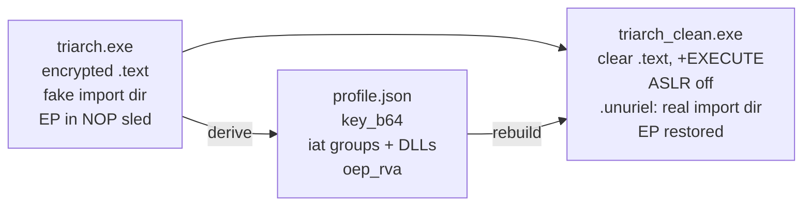

<details>
<summary><strong>[Expand] See it yourself — before and after, side by side</strong></summary>

1. Open `triarch.exe` and `triarch_clean.exe` in two PE-bear windows. **Imports**: one DLL (`client_x86.dll` → `FireInTheHole`) versus the ~22 real DLLs. **Section Hdrs**: the clean one has an extra `.unuriel` section at the end and `.text` has its execute flag back. **Optional Hdr**: the entry point moved into `.text` and *DllCharacteristics* lost the *Dynamic Base* bit.

   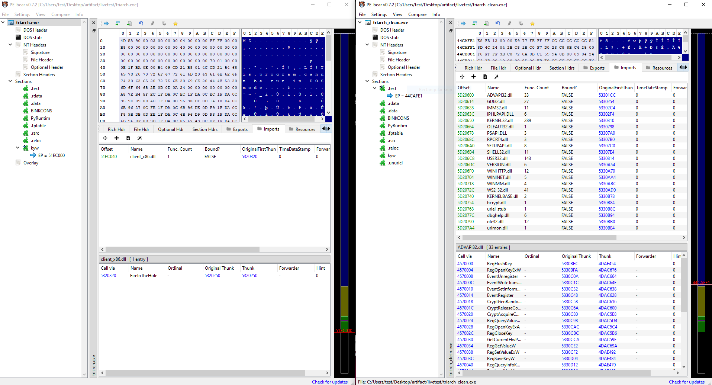

2. DiE entropy on the clean exe: `.text` now reads about 6.5 — real code.
3. Ghidra on the clean exe: strings, cross-references and readable functions everywhere. This is the file every later document works on.

</details>

## 6. The live method, kept as a fallback

Function: `harvest(args)`. Windows only (it uses `ReadProcessMemory` through `ctypes`).

This is the original approach from before the static attack existed. It is retained for two reasons: as insurance against a future build that changes the on-disk layout enough to break `derive`, and as the only way to regenerate `tools/imports_db.json`, since that table needs runtime addresses.

```
python tools/unuriel.py harvest triarch.exe <pid> <live_base_hex> -o profile.json
```

How it works:

1. **Launch and wait.** Something (the patcher's `--live` mode, or you by hand) starts the game and waits until the in-memory `.text` no longer matches the disk. Because decryption is lazy, this requires the game to actually execute code — clicking around the login screen is enough.
2. **Vote per page offset.** For every committed, executable, non-guard page in the `.text` range, read the 4096 bytes, undo any base relocations the loader applied (so the comparison is against the file's preferred base), XOR against the corresponding page on disk, and add one vote per offset. The key byte is the majority at each offset; the profile records how many offsets were unanimous.
3. **Read the resolved IAT.** After the protector has filled in the slots, read all 0xA20 bytes. For each non-zero slot, find the loaded module whose export table contains that address and record `(DLL, export name)`. Forwarder entries are skipped because the address they hold belongs to another DLL.
4. **Find the OEP** the same way `derive` does, on the text decrypted with the voted key.

The patcher's `--live` path adds a **cross-check**: after harvesting, it independently runs the static histogram over the file and reports how many of the 4096 bytes agree. The static value is the safer of the two when they disagree, because it is computed from ~2,500 pages rather than however many the game happened to execute.

## 7. Verification

`derive` and `rebuild` were run on **eight distinct client builds**, PE timestamps 2026-07-27 through 2026-08-30, each with a different keystream, a different injected section name and a different import directory RVA. Every one derived and rebuilt offline without intervention.

For the two builds that also had a known-good clean executable produced by the live method, the offline result was compared section by section: **`.text`, the entry point and every data section were byte-identical.** The only differences were the ones expected from the method — the layout of the new `.unuriel` section, and import names that the live harvest had resolved through forwarders (section 3).

The static key recovery itself: byte-identical to the live harvest where one existed, 0 weak offsets on all eight builds, about 3 seconds per build. The OEP finder: 3 candidates on every build, top score correct on every build.

## CLI reference

```
python tools/unuriel.py derive  <triarch.exe> -o profile.json [--db imports_db.json]
python tools/unuriel.py rebuild <triarch.exe> profile.json -o triarch_clean.exe
                                [--stub-dll uriel_stub] [--force]
python tools/unuriel.py harvest <triarch.exe> <pid> <live_base_hex> -o profile.json

python tools/ksattack.py <encrypted.exe> [decrypted.exe] [--pages N]
```

| Command | Needs | Produces |
|---|---|---|
| `derive` | the exe; `tools/imports_db.json` (found next to the script by default) | `profile.json` with `method: "static"` |
| `rebuild` | the exe and a profile whose `source_sha256` matches it | the clean exe; prints the sha256 of the result |
| `harvest` | Windows, a running instance, its PID and load base | `profile.json` with vote statistics |
| `ksattack.py` | the exe; optionally a decrypted twin for scoring | `keystream.bin`, or a score report |

`derive` is pure Python with no third-party dependencies and runs on any OS. The patcher (document 03) calls `derive` and `rebuild` in-process with exactly the arguments above.

## Exercises for the reader

1. **Reproduce the attack by hand.** Take the `recover_key` snippet from section 1, point it at the `.text` bytes of a protected exe (use `text_section()` from `tools/ksattack.py` to find them), and XOR the first page with the result. Disassemble the output with any x86 disassembler. Does it look like code?
2. **Measure the byte distribution.** Histogram the bytes of a decrypted `.text`. What fraction is `0x00`? What is the second most common byte? How few pages does `recover_key` actually need before it gets all 4096 bytes right? (Try `--pages` in `ksattack.py`.)
3. **Break the decoder on purpose.** Change `decode_iat` to stop at the first zero byte instead of trusting the length word, run `derive`, and count how many names come out truncated. Then find one of those names and show, byte by byte, why the zero appeared.
4. **Find the ordinal tie yourself.** Print the 22 groups with their DLL names and note where the `#6`-only group sits. Which DLL name sorts between its neighbours? Confirm from `tools/imports_db.json` which function that ordinal is.
5. **Add a third scoring property.** `find_oep` filters candidates with five tests and then scores the survivors on two properties. Think of a third property of `__scrt_common_main_seh` that could be checked (hint: what does it do just before calling `main`?), implement it, and see whether the three candidates now separate even further.
6. **Diff two builds.** Run `derive` on two different builds and compare the profiles. Which fields change? Which are identical? Why is the IAT layout the same when the key is not?
