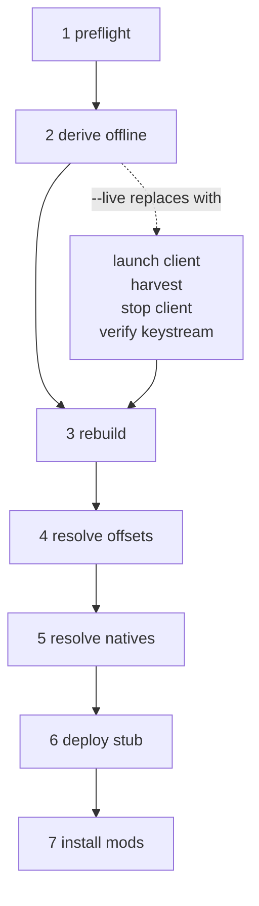
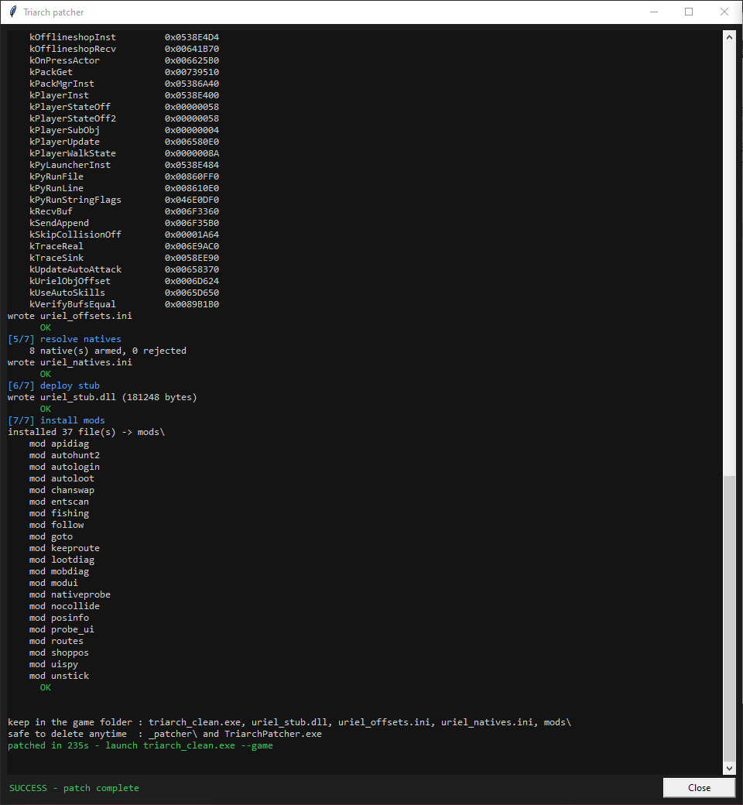
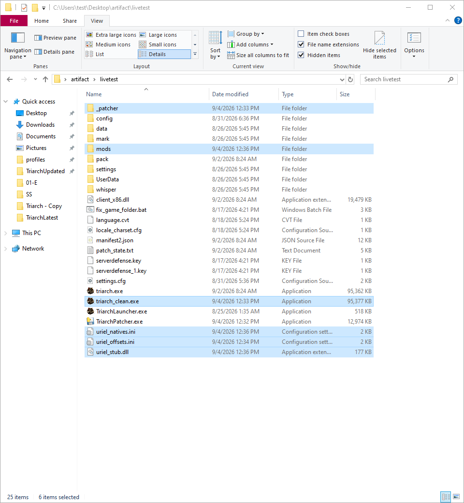
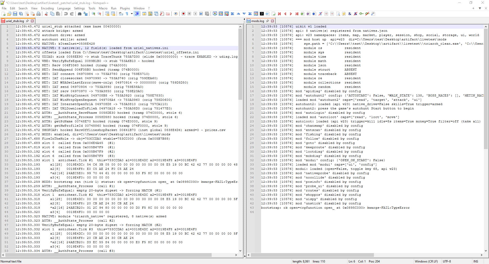

# 03 — The patcher pipeline

The previous document explained how a protected client is unpacked. This one describes `patcher/` — the program that packages that work, plus everything a mod host needs, into a single executable a user drops into the game folder and double-clicks. It is written as a specification: for each step, what it reads, what it writes, and how it fails.

Read it with `patcher/src/triarch_patcher/pipeline.py` open. The step functions are named `step_*` and appear in the same order as below.

## Contents

- [What the patcher produces](#what-the-patcher-produces)
- [The steps in order](#the-steps-in-order)
- [Evidence: one full run, one live boot](#evidence-one-full-run-one-live-boot)
- [The `--live` fallback path](#the---live-fallback-path)
- [The `--console` mode and the GUI](#the---console-mode-and-the-gui)
- [Output files and what breaks without each](#output-files-and-what-breaks-without-each)
- [The `_patcher\` folder](#the-_patcher-folder)
- [config.json: preserved, but build constants are stamped](#configjson-preserved-but-build-constants-are-stamped)
- [How the executable is built](#how-the-executable-is-built)
- [Running from source](#running-from-source)
- [Why it is version independent](#why-it-is-version-independent)

## What the patcher produces

The patcher never modifies `triarch.exe`. It reads it and writes new files beside it:

```
<game folder>\
    triarch.exe             (untouched)
    client_x86.dll          (untouched - the protector's DLL, no longer loaded by the clean exe)
    triarch_clean.exe       <- decrypted, imports restored, ASLR off; launch this
    uriel_stub.dll          <- replaces client_x86.dll for the one call the game makes
    uriel_offsets.ini       <- every address the stub hooks, resolved for THIS build
    uriel_natives.ini       <- the triarch_native gateway table, resolved for THIS build
    mods\                   <- mod host (modhost.py, api.py, uikit.py), config.json, one folder per mod
    _patcher\               <- disposable: profile.json, patcher_run.log, runtime logs
```

The user then launches `triarch_clean.exe --game`. The clean exe imports `uriel_stub.dll` (document 02, rebuild step 4), which loads at process start, reads the two `.ini` files, installs its hooks, and bootstraps the Python mod host from `mods\`.

## The steps in order

`pipeline.run()` executes a list of `(name, function)` pairs and stops at the first exception. A `Failure` is a diagnosed problem with a message; any other exception is reported with its type. Each step logs `OK` or `FAILED: <reason>`, and every line also goes to `_patcher\patcher_run.log`.



### 1. preflight

| | |
|---|---|
| Reads | Existence of `triarch.exe` and `client_x86.dll` in the folder |
| Writes | A probe file (created and deleted); creates `_patcher\` |
| Fails when | Either file is missing ("is this the game folder?"); the folder is not writable; `triarch_clean.exe` exists and cannot be renamed onto itself, which on Windows means it is running |

The rename-onto-itself test is the cheap way to ask "is this file open for execution?" without process enumeration.

### 2. derive (offline)

| | |
|---|---|
| Reads | `triarch.exe`; the vendored `imports_db.json` |
| Writes | `_patcher\profile.json` |
| Calls | `unuriel.derive` in-process (`_call_tool` swaps `sys.argv` and captures stdout into the log) |
| Fails when | `derive` exits non-zero or produces no file — the message suggests `--live` |

After a successful run it re-reads the profile and *nudges* (a highlighted log line) on two soft conditions: any keystream offsets with a weak majority, and any import names that were not in the table and inherited their group's DLL. Neither is fatal; both are the early warning that a future build has changed something.

### 3. rebuild

| | |
|---|---|
| Reads | `triarch.exe`, `_patcher\profile.json` |
| Writes | `triarch_clean.exe` |
| Calls | `unuriel.rebuild ... --stub-dll uriel_stub` |
| Fails when | rebuild exits non-zero or the output is missing |

The `--stub-dll uriel_stub` argument is what makes the clean exe import `uriel_stub.dll` in place of `client_x86.dll`.

### 4. resolve offsets

| | |
|---|---|
| Reads | `triarch_clean.exe` (scanned repeatedly — this is the slow step) |
| Writes | `uriel_offsets.ini`; stashes the values on the run context for step 5 |
| Calls | `mkoffsets.resolve_all(clean_exe)` |
| Fails when | Any *required* offset is unresolved |

Every address the stub hooks is re-derived here from the decrypted binary — by string literal, by import name, or by instruction shape, never by a stored number. The details are in [04-offsets-and-ini-files.md](04-offsets-and-ini-files.md). Two categories:

- **Required** offsets: a miss fails the run, because a stub with a wrong hook address would crash or silently do the wrong thing.
- **Optional** offsets (`OPTIONAL_OFFSETS`: the Python-interpreter entry points and the pack manager — `kPyRunLine`, `kPyRunFile`, `kPyRunStringFlags`, `kPyLauncherInst`, `kPackMgrInst`, `kPackGet`): a miss is logged as "not found (optional - mod host disabled)" and the run continues. The stub reads these as an optional block and skips mod loading when they are absent, so losing one on a new build disables mods and nothing else.

The ini format is one `name=HEX` line per resolved offset under `[offsets]`, with a comment line reminding the reader to regenerate after updates.

### 5. resolve natives

| | |
|---|---|
| Reads | `triarch_clean.exe`; the bundled `resources/natives.json` (a registry of native functions and typed fields, with their anchors); the offsets from step 4 |
| Writes | `uriel_natives.ini` |
| Calls | `mkoffsets.write_natives_ini(clean, registry, out, vals=offsets)` |
| Fails when | The bundled registry is missing, or any native is unresolved |

This step generates the table behind `triarch_native`, the Python module the stub registers inside the game's interpreter so mods can call engine functions and read engine fields. It is deliberately computed from the *same* decrypted exe, in the same run, using the *same* offset values as step 4 — so the two ini files can never describe different builds.

The failure policy here is the strictest in the pipeline, and the module docstring explains why: the stub treats a missing or incomplete gateway as "natives off" and carries on. A silent skip would ship a client that runs perfectly, logs nothing alarming, and has no working mods. So an unresolved native fails the run loudly rather than shipping.

### 6. deploy stub

| | |
|---|---|
| Reads | The bundled `resources/uriel_stub.dll` and its recorded `uriel_stub.dll.sha256` |
| Writes | `uriel_stub.dll` in the game folder |
| Fails when | The blob is under 4096 bytes or does not start with `MZ`; its sha256 differs from the recorded one; it does not contain the string `triarch_native`; the write is short |

The sha256 check catches one specific historical accident: PyInstaller finding UPX on the build machine and repacking the DLL inside the frozen exe, which changes bytes the stub patches in itself at load time. The `triarch_native` string check catches a stub built from source that predates the native gateway. If no recorded hash exists at all, the step says so out loud ("stub integrity NOT verified") rather than staying quiet, because silence would read as "verified".

### 7. install mods

| | |
|---|---|
| Reads | The bundled `resources/mods/` tree |
| Writes | `<game>\mods\` — every file copied, except `config.json` when one already exists; then stamps build constants into `config.json` |
| Fails when | The bundled tree is missing |

`_copy_tree` never deletes anything already present, skips `__pycache__` and compiled files, and reports "kept your existing config.json" when it preserves the user's settings.

<details>
<summary><strong>[Expand] See it yourself — run it and read the log</strong></summary>

1. Copy `TriarchPatcher.exe` next to `triarch.exe` and run it. The log window colours each step; the same text lands in `_patcher\patcher_run.log`.

   

2. When it finishes, list the game folder: `triarch_clean.exe`, `uriel_stub.dll`, `uriel_offsets.ini`, `uriel_natives.ini`, `mods\`, `_patcher\`. Open the two `.ini` files — every line is an address that was derived minutes ago from the file in front of you.

   

3. Launch `triarch_clean.exe --game`. In `_patcher\` the file `uriel_stub.log` appears (the DLL announcing what it armed) and, in the same folder, `mods.log` (the mod host listing the mods it loaded).

</details>

## Evidence: one full run, one live boot

Recorded on 2026-09-02 against the newest build available (PE timestamp
2026-08-30), in a fresh copy of a game folder with every generated file
removed. The frozen `TriarchPatcher.exe` was built from this tree.

```
[2/7] derive (offline)   keystream: 17759 pages, 0 weak offsets
                         IAT: 22 groups, 626 imports (34 by ordinal), 0 unresolved
                         OEP: rva 0x44dabe1 (3 candidates)
[3/7] rebuild            22 import descriptors, .unuriel section, entry point restored
[4/7] resolve offsets    wrote uriel_offsets.ini
[5/7] resolve natives    8 native(s) armed, 0 rejected
[6/7] deploy stub        wrote uriel_stub.dll (181248 bytes)
[7/7] install mods       installed 39 file(s) -> mods\
patched in 234s - launch triarch_clean.exe --game
```

Then `triarch_clean.exe --game`, from `_patcher\uriel_stub.log`:

```
uriel_stub attached (exe base 00400000)
NATIVE: 8 native(s), 12 field(s) loaded from uriel_natives.ini
offsets loaded from ...\uriel_offsets.ini
NET: Recv 006F3360 hooked   NET: SendAppend 006F35B0 hooked
AUTH: __AuthState_RecvPhase 0058DE30 hooked   AUTH: __AuthState_Process 0058D580 hooked
MODS: bootstrap ran (tick 1) status: ok
NATIVE: module 'triarch_native' registered, 8 native(s) armed
```

and from `_patcher\mods.log`: `mod host up api=v23`, one `loaded mod` line
per enabled mod, no tracebacks. The `8 native(s)` in the lines above are the
**gateway natives** declared in `mods/natives.json` — engine functions reached
through `triarch_native.call`. The 22 **stub functions** that make up the
`triarch_native` module itself are a different count; document 05 keeps the
two apart. The client reached the login screen and was
still running, ticking the anti-cheat slot every frame, 100 seconds later.
No REJECT or FAIL line appeared in either log.

One thing the boot showed that is worth knowing: a probe mod that imports
`triarch_native` during its `on_load` saw `None`. The mod host's first tick
ran 82 ms *before* the stub registered the module. Mods that need natives at
load time must wait for the first `on_update`, or be reloaded once; the shipped
mods do the former.

### What to expect, command by command

The numbers above are scattered through three documents. This table collects
them so a run can be checked line by line without reading the chapters. "On the
reference build" means the PE timestamp 2026-08-30 build the evidence was
recorded on; timings are from an ordinary desktop.

| Command | Line to look for | On the reference build | If it differs |
|---|---|---|---|
| `python tools/ksattack.py triarch.exe` | `.text raw 0x400, N pages, sampling M`, then `offsets with a weak mode (<5%): N`, then `wrote keystream.bin (unverified)` | 17759 pages; 0 weak; about 2 s | Far fewer pages: not the protected exe, or `.text` was not found. Weak offsets: the vote is noisier than on any build seen — do not trust the key until `derive` agrees. |
| `python tools/ksattack.py triarch.exe triarch_clean.exe` | `keystream constant across 400/400 sampled pages`; `assume plaintext 0x00 : 4096/4096 (100.0%)` | exactly that | Under 4096: the twin is a different build, or the key is not tiled per page the way document 01 describes. |
| `python tools/unuriel.py derive triarch.exe -o profile.json` | `keystream : recovered from N pages of ciphertext, N weak offset(s)` | `0 weak offset(s)`; about 12 s in total | 1–64 weak: inspect before trusting. Over 64: `derive` stops on purpose ("the file is not what we think it is"). |
| same | `IAT : 22 groups, 626 imports (34 by ordinal), 0 name(s) not in the table` | as shown | Names not in the table with `inherited` lines: the build added imports — fine, but read them. An unresolved group: regenerate `imports_db.json` with a live harvest (document 02, section 6). |
| same | `OEP : 0x... (rva 0x...) (3 candidates)` | 3 candidates, top score 11 | 0 candidates: the key is wrong or the CRT entry's shape changed. More than 3: check that the winner scored 11 (cookie write found, `jmp` target never called). |
| `python tools/unuriel.py rebuild ... --stub-dll uriel_stub` | the eight `[1]`–`[8]` lines, the `.unuriel` section, `entry point 0x... -> 0x...`, `wrote ... (N bytes)` | about 8 s; about 97 MB written | `source_sha256` mismatch: the profile was derived from a different file. |
| `python tools/mkoffsets.py triarch_clean.exe` | one `kName = 0x...` per key, `kSlot2ArgBytes = 0x1C`, `all anchors resolved`, exit 0 | 70 keys; about 60 s | `*** NOT FOUND ***` on a key: a shape stopped matching and needs a new anchor (document 04, section 9). A changed non-address value (`kSkipCollisionOff`, `kPlayerWalkState`, ...): a class grew or a constant moved. |
| patcher `[2/7]` and `[3/7]` | the same numbers as `derive` and `rebuild` above | | |
| patcher `[5/7]` | `8 native(s) armed, 0 rejected` | as shown | `rejected > 0`: a declared stack width disagrees with the binary's `ret N`; the entry is dropped and the preceding `rejected:` line names it. |
| patcher `[6/7]` | `wrote uriel_stub.dll (181248 bytes)` | as shown, for the DLL built from this tree | A different size with the sha256 check passing is simply a different stub build. A sha256 failure is the UPX accident described under step 6. |
| patcher `[7/7]` | `installed N file(s) -> mods\` | 37 from this tree's `mods/` (the evidence run above reported 39 because the checkout it was built from carried one extra mod folder, since removed — see the note on default enablement in document 07) | More than your `mods/` holds: extra folders were bundled, and every one of them loads unless `config.json` says otherwise. |
| patcher, last line | `patched in Ns - launch triarch_clean.exe --game` | 230–240 s, almost all of it step 4 | Much longer: a slow disk, or an antivirus scanning the 97 MB output as it is written. |
| `_patcher\uriel_stub.log` | `NATIVE: 8 native(s), 12 field(s) loaded from uriel_natives.ini` | as shown | Fewer: a rejected entry, listed just above it. `NATIVE: no uriel_natives.ini`: step 5's output is missing and mods will silently do nothing. |
| same | `NATIVE: module 'triarch_native' registered, 8 native(s) armed` | about 6 s after `DllMain` | Absent: the launcher never appeared (`kPyRunLine` / `kPyLauncherInst` missing — "mod host disabled" in step 4) or `InitModule` faulted; one `NATIVE:` line says which. |
| `_patcher\mods.log` | `=== mod host up  api=v23` | the first line of the file | File absent: read the `MODS:` lines in `uriel_stub.log` — `mods.off`, or the bootstrap `status:` string. |

## The `--live` fallback path

`run(folder, log, live=True)` replaces step 2 with four steps and keeps everything from step 3 on:

| Step | What it does | Fails when |
|---|---|---|
| launch client | Starts `triarch.exe --game` detached (`winproc.launch`), shows a banner asking the operator to click around the window, and polls up to 90 s until the first page of in-memory `.text` differs from disk (`winproc.wait_for_decrypt`). Then polls up to 120 s until every IAT slot has stopped changing for three consecutive seconds (`winproc.wait_for_iat`). Two launch attempts. | The client exits early, or never decrypts after two attempts |
| harvest | `unuriel.harvest <exe> <pid> <base>` in-process | Non-zero exit; or the harvest output reports any unresolved IAT slot — a half-filled table would produce a clean exe that crashes at its first call through a NULL slot |
| stop client | `proc.kill()` | Never — also called on any failure so a client is not left running |
| verify keystream | Recomputes the key statically from the file (same histogram as `derive`, ~2,500 pages) and reports how many of the 4096 bytes agree with the harvested key | The harvested key is not 4096 bytes |

The banner exists because of transformation 2 in document 01: decryption is lazy, so a client left idle at the login screen decrypts very little and the wait can run out. The GUI mirrors any "nudge" line into its status bar and rings the bell once per step so the request is not scrolled away.

The live path needs Windows (it uses `CreateToolhelp32Snapshot` and `ReadProcessMemory` through `ctypes`). It is the way to regenerate `imports_db.json` when a build introduces imports the table has never seen, and the insurance policy if a future build changes the on-disk layout enough that `derive` stops working.

## The `--console` mode and the GUI

`__main__.py` decides the game folder from, in order: the first non-flag argument; the directory containing the frozen exe; the current directory. Then:

- **Default:** `ui.main()` opens a Tk window — a scrolling coloured log, a status line and a Close button that enables when the run finishes. The pipeline runs on a worker thread and posts lines through a queue. If Tk cannot start (no display, a service session), it falls back to running headless and writing `_patcher\patcher_run.log`.
- **`--console`:** skips the GUI, prints every log line to stdout, exits 0 on success and 1 on failure. This is the mode for scripts and for reading a failure without a window.
- **`--live`:** combinable with either; selects the fallback step list.

## Output files and what breaks without each

All five outputs are consumed by the stub or the loader at game start. Each has a distinct failure mode when absent, and the distinction matters because two of them are silent.

| File | Consumer | If missing |
|---|---|---|
| `triarch_clean.exe` | The user | Nothing to launch. `triarch.exe` still works exactly as before, with the protector |
| `uriel_stub.dll` | The Windows loader (it is an import of the clean exe) | The clean exe does not start: the loader reports the missing DLL before any game code runs. Loud |
| `uriel_offsets.ini` | `uriel_stub.dll` at `DLL_PROCESS_ATTACH` | The stub logs `FATAL: ... not found - run the patcher for this build` and runs **inert**: no hooks, no mod host. The game runs as an unprotected, unmodified client. Visible only in `_patcher\uriel_stub.log` |
| `uriel_natives.ini` | `uriel_stub.dll`, after the offsets load | **Silent.** The stub logs `NATIVE: no uriel_natives.ini - gateway disabled (this is fine)` and continues. Hooks install, the mod host starts, mods load — but `triarch_native` is never registered, so actor and ground-item enumeration, the typed player fields and the native hunt drive are absent. Every mod that depends on them does nothing, without error. This is the failure the pipeline's step 5 and its strict policy exist to prevent |
| `mods\` | `uriel_stub.dll` | The stub logs `MODS: no <dir> - mod host idle`. The game runs with hooks but no Python mods. Quiet, but at least the mods folder being absent is visible in Explorer |

The asymmetry is the point: a missing DLL fails at the loader; a missing offsets file fails at attach with a FATAL line; a missing natives file does not fail at all. The pipeline treats the last one as the most dangerous precisely because nothing downstream will complain.

<details>
<summary><strong>[Expand] See it yourself — the stub and the mod host reporting in</strong></summary>

1. Open `_patcher\uriel_stub.log` after the first launch: the offsets it read, the natives it armed, the hooks it placed, anything it rejected.
2. Open `_patcher\mods.log` (the mod host writes into the same folder): one line per mod loaded or disabled, and the hot-reload messages when you save a mod file while the game runs.



</details>

## The `_patcher\` folder

Everything disposable goes here so the game folder stays tidy. Written by the patcher:

- `profile.json` — the derived key, import groups and OEP (document 02). Useful for diffing builds or for a manual `rebuild`.
- `patcher_run.log` — every line of the last run.

Written by the stub at runtime (it creates the folder itself if the patcher's copy was deleted):

- `uriel_stub.log` — the stub's own log, including the FATAL/NATIVE/MODS lines quoted above.
- `mods.log` — the mod host's log.
- Feature toggles read at attach, such as `mods.off` (skip the mod host for one run).

The final log line of a successful run states it plainly: keep `triarch_clean.exe`, `uriel_stub.dll`, `uriel_offsets.ini`, `uriel_natives.ini` and `mods\`; `_patcher\` and the patcher exe itself are safe to delete at any time.

## config.json: preserved, but build constants are stamped

`mods\config.json` is the one file in the tree a user edits — which mods are enabled and their settings. Step 7 therefore never overwrites an existing copy. Resetting a user's choices on every game update would be a bug of its own.

There is one exception, and it is precise. Some values in `config.json` are not preferences: they are facts about the build. `BUILD_CONSTANTS` in `pipeline.py` lists them:

| Mod | Key | Source offset |
|---|---|---|
| `nocollide` | `WALK_STATE` | `kPlayerWalkState` |
| `autohunt2` | `WALK_STATE` | `kPlayerWalkState` |
| `keeproute` | `WALK_STATE` | `kPlayerWalkState` |
| `routes` | `WALK_STATE` | `kPlayerWalkState` |

`WALK_STATE` is the numeric value of the player's "auto-moving" state, read out of the engine's own comparison instruction by `tools/mkoffsets.py`. Four mods gate behaviour on it. If a game update changed the number, a copy left in `config.json` would silently stop detecting the state — a mod that used to work would just do nothing. So `_stamp_build_constants` writes these keys into `config.json` on every run, even when the file already existed, and logs `stamped build constants: nocollide.WALK_STATE=0x..` when a value changed. The write is atomic (temp file, then `os.replace`). Anything the resolver could not produce is left as shipped and noted.

The rule this encodes: **a user's preference survives an update; a build fact is re-derived on every update.** `patcher/config.example.json` shows the shape of the file for the sixteen user-facing mods. It omits `routes` and the four diagnostic probes (`apidiag`, `nativeprobe`, `probe_ui`, `uispy`); the shipped `mods/config.json` carries `"enabled": false` sections for all five. Because a mod with no section loads by default (document 07, "A note on default enablement"), do not copy the example over `config.json` wholesale without adding those sections.

## How the executable is built

The patcher is frozen into `TriarchPatcher.exe` with PyInstaller. Two scripts and one spec are involved.

**`patcher/sync.py`** stages inputs from the rest of the repository into the package:

| Source | Destination in the package |
|---|---|
| `tools/mkoffsets.py`, `namemods.py`, `unuriel.py`, `ksattack.py`, `imports_db.json` | `src/triarch_patcher/vendor/` |
| `mods/` (whole tree, minus `__pycache__`) | `src/triarch_patcher/resources/mods/` |
| `mods/natives.json` | `src/triarch_patcher/resources/natives.json` |
| `stub/uriel_stub.dll` (if built) | `src/triarch_patcher/resources/uriel_stub.dll` + `.sha256` |

The copies are generated and never hand-edited: a fix made in `tools/mkoffsets.py` and not in the vendored copy would be a silent wrong-address bug, which is the class of bug the project exists to avoid. `python sync.py --check` exits 1 if any copy is stale, for CI. Mods deleted upstream are removed from the package so a dropped mod does not keep shipping.

**`patcher/build.bat`**, in order:

1. With the `stub` argument, calls `stub/build_stub.bat` to compile `uriel_stub.dll` (wrapped in `pushd`/`popd` because that script changes directory).
2. *Always* runs `sync.py`. The comment records why: a build once left an old DLL in `resources/`, froze it, and recomputed the hash from the stale file, so the integrity check confirmed the wrong binary. Copying unconditionally closes that.
3. Fails if `uriel_stub.cpp` is newer than the built DLL — "everything reports OK and the features are just missing" is the most confusing failure mode.
4. Runs PyInstaller: `--onefile --windowed --noupx`, with `--add-data` for the DLL, its hash, `natives.json`, `imports_db.json` and the mods tree; `--collect-all capstone`; and hidden imports for every module the package loads dynamically.

Two flags deserve explanation:

- **`--noupx`.** If UPX is on `PATH`, PyInstaller compresses every binary it bundles, including `uriel_stub.dll`. The stub self-patches at load time, so any change to its bytes breaks it; the sha256 check in step 6 is the runtime guard for the same thing.
- **`--collect-all capstone`.** `tools/mkoffsets.py` uses the Capstone disassembler for one job: reading the immediate operand of `ret imm16` instructions to cross-check each native's declared stack width against the binary, which needs real instruction boundaries rather than byte patterns. Capstone ships a native library; a plain `--hidden-import` would bundle the Python wrapper and leave the DLL behind, failing at run time.

**`patcher/TriarchPatcher.spec`** is the equivalent PyInstaller spec (`upx=False`, `console=False`, `collect_all('capstone')`), and **`patcher/entry.py`** is the freeze target: PyInstaller runs its entry script as `__main__` with no package context, so the package's own `__main__.py` cannot be used directly; `entry.py` imports `main` through the package name to keep the relative imports valid.

## Running from source

Requirements: Python 3, `capstone` (`pip install capstone`), and Tk for the GUI (bundled with the standard Windows installer; optional if you use `--console`). `derive`, `rebuild` and offset resolution are pure Python and run on any OS; the `--live` path and the resulting game are Windows-only.

```
cd patcher
python sync.py                                    # stage tools/, mods/, stub DLL into the package
set PYTHONPATH=src                                # or: export PYTHONPATH=src
python -m triarch_patcher "C:\Games\Triarch" --console
python -m triarch_patcher "C:\Games\Triarch"      # GUI
python -m triarch_patcher "C:\Games\Triarch" --console --live
```

`sync.py` will warn if `stub/uriel_stub.dll` has not been built; without it step 6 has nothing to deploy. Build it first with `build.bat stub` (needs the Microsoft C++ toolchain) or drop a prebuilt DLL into `stub/`.

## Why it is version independent

The patcher carries no knowledge of any particular build. Every build-specific fact is recomputed from the file at hand:

| Fact | Varies per build? | How it is obtained |
|---|---|---|
| The 4096-byte keystream | Yes, every build | Many-time-pad histogram over `.text` (document 02, section 1) |
| Import names | Layout stable so far; decoded anyway | XOR with the key's first bytes, length from the hint word (document 02, section 2) |
| DLL per import group | Stable | `imports_db.json` by name; ordinal tables plus sort order for ties (document 02, section 3) |
| Injected section name, import directory RVA | Yes, every build | Read from the section table and data directories; never assumed |
| Original entry point | Yes | CRT entry located by shape (document 02, section 4) |
| Every hook address in `uriel_offsets.ini` | Yes | Re-derived structurally by `tools/mkoffsets.py` from a string, an import, or an instruction shape — [04-offsets-and-ini-files.md](04-offsets-and-ini-files.md) |
| Every native and field in `uriel_natives.ini` | Yes | Same resolver, same run, same decrypted exe |
| `WALK_STATE` and other build constants in `config.json` | Yes | Read from the engine's own instructions and stamped in (this document) |

Nothing in the shipped executable is a stored address. When a build changes something the resolvers cannot find, the pipeline fails at the step that noticed, names the missing item, and writes nothing that would run half-working. That failure is the designed outcome; the alternative — a stale number that happens to point somewhere — is the bug this design exists to rule out. How the structural resolvers work, and how to add one, is the subject of [04-offsets-and-ini-files.md](04-offsets-and-ini-files.md).
