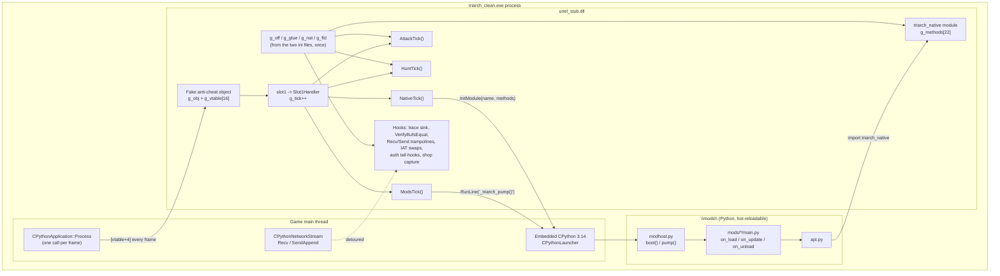

# 05 — The stub DLL: `uriel_stub.dll`

The previous chapters removed the protector from `triarch.exe`. This chapter is about the small DLL that takes its place: `stub/uriel_stub.cpp`, about 3,500 lines of C++ with inline x86 assembly, built into `uriel_stub.dll` and dropped next to the rebuilt executable by the patcher.

It does two jobs. The first is to *be* the anti-cheat as far as the game can tell — answer the calls the game makes into it, construct the objects the game expects, return the values that let the login proceed. The second is to be the native half of a mod framework: it installs hooks, drives the game's own embedded Python interpreter, and exposes a handful of engine functions to Python that no shipped binding offers.

This is a reference, not a tutorial, but every mechanism is explained from first principles when it first appears. Read `stub/uriel_stub.cpp` alongside it — every claim below is something you can find in that file.

## Contents

- [1. How the DLL gets into the process](#1-how-the-dll-gets-into-the-process)
  - [1.1 The renamed import](#11-the-renamed-import)
  - [1.2 DllMain](#12-dllmain)
  - [1.3 FireInTheHole: the one export](#13-fireinthehole-the-one-export)
  - [1.4 The two ini files, read once](#14-the-two-ini-files-read-once)
  - [1.5 Logs and control files](#15-logs-and-control-files)
  - [1.6 The boot timeline, measured](#16-the-boot-timeline-measured)
- [2. Architecture](#2-architecture)
  - [2.1 The per-frame tick](#21-the-per-frame-tick)
  - [2.2 Driving the game's own Python](#22-driving-the-games-own-python)
  - [2.3 Bootstrapping modhost.py](#23-bootstrapping-modhostpy)
  - [2.4 The pump and hot reload](#24-the-pump-and-hot-reload)
  - [2.5 The triarch_native module](#25-the-triarch_native-module)
- [3. The anti-cheat interface: eight vtable slots](#3-the-anti-cheat-interface-eight-vtable-slots)
- [4. Every hook the stub installs](#4-every-hook-the-stub-installs)
  - [4.1 Techniques used](#41-techniques-used)
  - [4.2 The hook table](#42-the-hook-table)
  - [4.3 Hook by hook](#43-hook-by-hook)
- [5. Stub functions and gateway natives](#5-stub-functions-and-gateway-natives)
  - [5.1 The 22 stub functions on `triarch_native`](#51-the-22-stub-functions-on-triarch_native)
  - [5.2 Stub function by stub function](#52-stub-function-by-stub-function)
  - [5.3 The `call` gateway and uriel_natives.ini](#53-the-call-gateway-and-uriel_nativesini)
  - [5.4 Typed fields](#54-typed-fields)
  - [5.5 Environment-variable channels](#55-environment-variable-channels)
- [6. Notable engineering](#6-notable-engineering)
- [7. Building](#7-building)
- [8. Extending the stub](#8-extending-the-stub)
  - [8.1 Adding a gateway native without touching C++](#81-adding-a-gateway-native-without-touching-c)
  - [8.2 Adding a stub function, which needs C++](#82-adding-a-stub-function-which-needs-c)
  - [8.3 Adding a hook](#83-adding-a-hook)
- [9. Quick reference](#9-quick-reference)

---

## 1. How the DLL gets into the process

### 1.1 The renamed import

Recall from chapter 01 that the protected `triarch.exe` imports exactly one DLL by name, `client_x86.dll`, and that the game calls one function from it: `FireInTheHole`. The unpacker (`tools/unuriel.py`, function `rebuild()`) has two ways to deal with that import:

- With no `--stub-dll` argument it drops the import entirely and rewrites every `call [slot]` to `FireInTheHole` into a `call` to a thirteen-byte in-image stub that writes a scratch pointer into the out-parameter and returns 1 (`mov eax,[esp+4]; mov dword ptr [eax], scratch; mov al, 1; ret` — 4 + 6 + 2 + 1 bytes, emitted in `rebuild()`).
- With `--stub-dll uriel_stub` — which is what the patcher passes (`patcher/src/triarch_patcher/pipeline.py`, `step_rebuild`) — the protector's import is **retained but renamed**: the same IAT slot, the same function name `FireInTheHole`, but the DLL name written into the new import descriptor is `uriel_stub`. The relevant lines in `rebuild()`:

```python
is_prot = e["dll"] and e["dll"].lower().startswith(PROTECTOR_DLL)
ok = (e["value"] and e["dll"] and e["name"] and (not is_prot or args.stub_dll))
if ok and is_prot:
    e = dict(e, dll=args.stub_dll)
```

Windows resolves imports at process start, before the executable's entry point runs. A name with no extension gets `.dll` appended by the loader, so the loader looks for `uriel_stub.dll` in the game folder, maps it, runs its `DllMain`, and writes the address of its `FireInTheHole` export into the IAT slot the game already uses. Nothing in the game's code changes; the pointer it calls through simply lands in our code instead of the protector's.

This is the whole loading mechanism. There is no injector, no launcher, no thread creation — the operating system does it, because the executable asks for it.

### 1.2 DllMain

`DllMain` runs on `DLL_PROCESS_ATTACH` and does everything that can be done before the game has executed a single instruction of its own:

1. `InitializeCriticalSection(&g_cs)` — one lock guards every log file.
2. `LogInit()` — locate the exe directory, create `<exe>\_patcher\`, delete the previous `uriel_stub.log`.
3. `g_obj.vptr = g_vtable` — the fake anti-cheat object is ready before anyone asks for it.
4. `LoadOffsets()` — read `uriel_offsets.ini`. If any *required* key is missing the stub logs `no offsets - running inert (no hooks)` and returns `TRUE` without installing anything; the game then runs unhooked (and will not get past the login gate, see section 3).
5. `ApplySlot2Ret()` — patch the stub's own code (section 6).
6. In this order, each behind a compile-time switch: `PatchTraceSink()`, `HookVerifyBufsEqual()`, `InstallNetHooks()`, `InstallAuthHooks()`, `InstallShopCapture()`, `ModsInit()`.

Two things are worth noticing. First, `DllMain` installs hooks into code that has not run yet — the executable's `.text` is fully decrypted on disk after chapter 02, so the bytes are there to patch. Second, nothing in `DllMain` touches Python: the interpreter does not exist yet. Everything that needs it is deferred to the per-frame tick (section 2.1).

### 1.3 FireInTheHole: the one export

`stub/uriel_stub.def` exports exactly one symbol:

```
LIBRARY client_x86
EXPORTS
    FireInTheHole
```

The `LIBRARY` line only sets the name recorded inside the DLL's own export directory; it does not affect which file the loader opens (that comes from the import descriptor, see 1.1). The export is:

```cpp
extern "C" BOOL __cdecl FireInTheHole(void** ppOut, void*)
{
    g_obj.vptr = g_vtable;
    if (ppOut) *ppOut = &g_obj;
    Log("FireInTheHole -> obj=%p vtable=%p (from 0x%08X)", ...);
    return TRUE;
}
```

The game expects a `cdecl` function (the unpacker checks for `add esp, N` after each call site before rewriting it) that stores a pointer to an object into `*ppOut` and returns non-zero. That object must have a vtable, because the game calls through it — `[vtable+0x04]` every frame, `[vtable+0x08]` at login. Section 3 lists what each slot has to do.

### 1.4 The two ini files, read once

The stub contains **no hardcoded game addresses**. It is the same DLL for every build of the client; what differs per build is two text files the patcher writes next to the exe:

- `uriel_offsets.ini`, section `[offsets]` — every address the hooks need, plus a few struct offsets and one non-address value (`SLOT2_ARG_BYTES`). Read by `LoadOffsets()`.
- `uriel_natives.ini`, sections `[pyglue]`, `[singletons]`, `[fields]`, `[natives]` — everything the `triarch_native` module needs. Read by `LoadNatives()`, called from the end of `LoadOffsets()`.

Both are produced by `tools/mkoffsets.py` ([docs/04](04-offsets-and-ini-files.md)) from the decrypted executable, and the patcher runs the resolver once so the two files describe the same build.

One caveat to "no hardcoded addresses": the stub does carry a handful of compiled-in *layouts* — MSVC container internals (the `std::map` node's `_Isnil` byte, a `std::vector`'s begin/end pair, the `std::string` short-string form) and a few game-struct member offsets (the ground item's two strings, the offline-shop record array and its stride, the shop entity's name and position). They are listed together at the end of section 5.2, and each is flagged in the source as verified live against the deployed build. Container layouts are a property of the compiler and survive a game rebuild; the game-struct offsets are the first thing to re-check when a build changes, and the reason the README's rule says "address" rather than "number".

`LoadOffsets()` splits the keys into a **required** list (the anti-cheat replacement and the network/auth hooks) and an **optional** list. A missing required key is fatal — the stub runs inert. A missing optional key merely disables one feature: the code that would use it checks `if (!g_off.xxx) return;`. This is how an ini written for an older stub keeps working with a newer DLL, and vice versa.

Both files are read **exactly once, in `DllMain`**. The values land in the static structs `g_off`, `g_glue`, `g_singleton`, `g_nat[]` and `g_fld[]` and are never re-read. The practical consequence: regenerating either ini under a running client changes nothing. A newly declared native or typed field needs the client restarted before Python can see it.

### 1.5 Logs and control files

Everything disposable goes to `<exe>\_patcher\`; only the two ini files stay beside the exe.

| File | Written by | Content |
|---|---|---|
| `_patcher\uriel_stub.log` | `Log()` | The stub's own diary: hook installation, slot calls (rate-limited), `NET:` connect/close lines, `AUTH:` stage hits, `MODS:` bootstrap status, `NATIVE:` registration, faults. Deleted at every start. Every line is timestamped to the millisecond so it can be lined up with `mods.log` and `netlog.txt`. |
| `_patcher\netlog.txt` | `NetLog()` | Cleartext packet capture, both directions, first 48 bytes per call, capped at 200,000 lines. Opened with `_fsopen(..., _SH_DENYWR)` so it can be read while the client runs. |
| `_patcher\udiag.log` | `TraceThunk()` | The client's own `[UDIAG]` diagnostic trace, re-enabled by the stub. Unbuffered, capped at 20,000 lines. |
| `_patcher\prices_YYYYMMDD_HHMMSS.csv` | `ShopCapture()` | Offline-shop item rows, only when armed. |
| `_patcher\mods.log` | Python (`mods/modhost.py`) | The mod host's log; the stub only reads its directory. |

Control files, all in `_patcher\`, all checked at load:

| File | Effect |
|---|---|
| `udiag.off` | Do not re-enable the diagnostic trace. |
| `mods.off` | Do not bootstrap the mod host this run. |
| `shopcap.on` | Arm the offline-shop price capture. |
| `prices_rotate.req` | (Checked at capture time, not at load.) Rotate the price CSV at the next capture; consumed. |

### 1.6 The boot timeline, measured

Sections 1.2–1.5 and 2.1–2.5 describe the pieces; this is *when* they run. The times are from one measured boot of a patched client to the login screen, in seconds after `DllMain`, read off `uriel_stub.log` and `mods.log` (both stamp milliseconds):

```mermaid
sequenceDiagram
    participant L as Windows loader
    participant S as uriel_stub.dll
    participant G as triarch_clean.exe
    participant P as embedded Python
    L->>S: DllMain (t = 0.000 s)
    Note over S: LoadOffsets and LoadNatives read both ini files once, 17 hooks installed (by +0.015 s)
    L->>G: entry point (CRT start-up)
    G->>S: FireInTheHole(ppOut) (+0.330 s)
    G->>S: slot 0 Initialize (+0.331 s)
    Note over G: window, renderer, interpreter come up (about 5.7 s)
    G->>S: slot 1 anticheat.Tick, first frame (+6.002 s)
    S->>P: RunLine(bootstrap), modhost.boot() (+6.085 s)
    P-->>S: TRIARCH_MODS = ok
    Note over P: first pump, mods load; a mod importing triarch_native here sees None
    S->>P: InitModule("triarch_native", g_methods) (+6.154 s)
    Note over S,P: from here on, pump every frame, natives available
```

Two things to read off it. First, for the six seconds before the first tick the stub does nothing but answer `FireInTheHole` and slot 0; everything else is the loader and the game's own start-up. Second, the mod host comes up about 70 ms before the module (82 ms on the boot document 03 records) because the registration poll runs one tick after the bootstrap poll (section 2.5) — which is why a mod must not touch `triarch_native` in `on_load` (document 06, section 8).

`Log()` has one subtlety worth learning from. Several hooks run between a Win32 call and the caller's subsequent `GetLastError()`. Opening a file with `fopen(..., "a")` sets the thread's last-error to `ERROR_ALREADY_EXISTS` even on success, and the first version of the stub made the client read 183 instead of `WSAEWOULDBLOCK` after `connect()` and report "server is down". Every logging function therefore saves `GetLastError()` on entry and restores it on exit.

---

## 2. Architecture



### 2.1 The per-frame tick

The game calls `[vtable+0x04]` on the anti-cheat object once per frame from `CPythonApplication::Process`, on the main thread, with the interpreter up (once it exists). The stub's `slot1` receives that call and forwards it to `Slot1Handler`, which is the heartbeat of everything time-driven in the DLL:

```cpp
g_tick++;
... anti-cheat bookkeeping (section 3) ...
ModsTick();     // bootstrap once, then pump every frame
AttackTick();   // env-var attack bridge, every 3rd tick
HuntTick();     // env-var hunt drive, every 15th tick
NativeTick();   // register triarch_native once Python is up
```

The order is deliberate: the anti-cheat bookkeeping comes first so a misbehaving mod cannot disturb what the client reads back from the call, and the attack/hunt ticks come after the pump so a target a mod set this frame is acted on immediately rather than a frame late.

There is no thread of the stub's own. Every piece of code in this file runs on a game thread, inside a call the game made. That is what makes calling engine functions from natives safe: the caller is already on the thread the engine expects.

### 2.2 Driving the game's own Python

The client is a Python application — a CPython 3.14 interpreter embedded in the exe with roughly 2,500 native bindings. The stub does not ship or link a Python; it uses the game's, through **one** function: `CPythonLauncher::RunLine(const char*)`, a `__thiscall` that evaluates a string in the launcher's main dictionary.

Why this function rather than the CPython C API? `PyRun_SimpleString` and friends are inside the exe too, but CPython 3.14 interns its identifier literals as immortal objects rather than plain C strings, so its entry points have no string references to anchor an offset resolver on. The game's own wrapper does: `PythonLauncher.cpp` is named in the file's trace calls, and `RunLine` takes a plain `char*`. The resolver finds it (`kPyRunLine`) and the singleton that holds the launcher (`kPyLauncherInst`); those two optional keys are all the stub reads. (`mkoffsets.py` also resolves `kPyRunFile` and `kPyRunStringFlags`, but the stub does not use them.)

`LauncherThis()` derives the `this` pointer exactly as the game's own `app.RunPythonFile` does — two dereferences from the holder — and additionally refuses to return it until `this+8` (the main dict) is non-NULL, because `RunLine` passes that dict to `PyRun_StringFlags` and a NULL there faults inside CPython.

### 2.3 Bootstrapping modhost.py

The launcher is constructed well after `DllMain`, so `ModsTick()` polls: every 30th tick (`g_tick % 30 == 1`) it asks `LauncherThis()`, and once that returns non-NULL it runs the bootstrap. `ModsInit()` (called from `DllMain`) has already decided whether mods are on at all: the `kPyRunLine`/`kPyLauncherInst` keys must be present, `<exe>\mods\` must exist, and `_patcher\mods.off` must not.

The bootstrap is one Python string, `kBootstrapFmt`, formatted with the mods directory and the log directory and handed to `RunLine`. Stripped to its essentials it does:

```python
_g = {'__name__': 'triarch_modhost', '__file__': _p, 'MODS_DIR': _d, 'LOG_DIR': _l}
exec(compile(open(_p, 'rb').read(), _p, 'exec'), _g)
builtins._triarch_pump = _g['pump']
_g['boot']()
```

That is: read `mods/modhost.py`, execute it in a fresh globals dict with `MODS_DIR` and `LOG_DIR` pre-set, publish its `pump` function as a builtin, call its `boot()`. Everything after this line is Python and hot-reloadable; the stub's contribution to the mod framework is finished.

Two constraints shaped that string, and both are documented in the source because both were learned on a live run:

- **`import traceback` fails.** The client replaces `__import__` with a hybrid importer that falls through to a zipimport of the stdlib appended to the exe, and that zip is not intact in the rebuilt executable. Only modules already in `sys.modules` (`os`, `sys`, `builtins`, `time`, `json`, ...) can be imported. The bootstrap formats exceptions by hand, walking `tb_next`.
- **No exception may escape.** `RunLine`'s error path calls the client's traceback printer, which pops a modal dialog. On failure the bootstrap installs a no-op pump and records the reason.

The bootstrap reports its result through the **process environment**, not a file: it sets `os.environ['TRIARCH_MODS']` to a status string, and the stub reads it back with `GetEnvironmentVariableA` and writes it to `uriel_stub.log`. The reasoning is that `RunLine` only reports "nothing escaped", the bootstrap swallows its own errors, and a log written by C is known to work when a log written by Python might not. `os.environ` round-trips to the Win32 environment block, so it is a channel both sides can use with no file I/O; the same trick carries the attack and hunt bridges (section 5.5).

If `RunLine` itself fails five times, `g_modsDead` is set and the stub stops touching Python for the rest of the session.

### 2.4 The pump and hot reload

Once `g_modsReady` is set, `ModsTick()` calls `RunLine("_triarch_pump()")` every `kPumpEvery` ticks — which is **1**, every frame. (An earlier value of 6 was lowered because on a slow machine it throttled a scanning mod to about 1.4 Hz.) Thirty consecutive pump failures stop the mod host.

Hot reload is entirely the Python side's business: `modhost.pump()` polls file modification times once a second (`RELOAD_POLL`) and re-executes a mod whose `main.py` changed, and reloads `api.py` and `uikit.py` the same way. `modhost.py` itself does not reload — it is the thing doing the watching. The stub knows nothing about any of this; it just keeps calling the builtin.

### 2.5 The triarch_native module

Python can only call what is registered with the interpreter. The game registers its ~50 modules through one helper, `InitModule(name, PyMethodDef*)`, which is `PyImport_AddModule` followed by `PyModule_AddFunctions` — so a module registered that way lands in `sys.modules` and `import triarch_native` just works. The resolver finds that helper (`kPyInitModule`) and six marshalling helpers (`PyTuple_GetUInt`, `GetString`, `GetFloat`, `Py_BuildValue`, `Py_BuildNone`, `Py_BuildException`) by anchoring on the names in the game's own method tables; the stub reads them from `[pyglue]`.

`NativeTick()` polls every 30th tick (`g_tick % 30 == 2`, one tick after the mods poll) until the launcher exists, then `RegisterNativeModule()` fills the 22-entry `g_methods[]` table and calls `InitModule("triarch_native", g_methods)`. If registration faults or returns NULL it is not retried. `api.py` deliberately does not cache a failed import of `triarch_native`, because the module appears a second or two into the run.

Every native is a `METH_VARARGS` C function `(self, args)` that unpacks its tuple with the game's own `PyTuple_Get*` glue and builds its return with `Py_BuildValue`. Section 5 lists all 22.

---

## 3. The anti-cheat interface: eight vtable slots

The game calls the anti-cheat object through a vtable. The slot names come from the client's own diagnostic strings, and the stub fills sixteen entries (slots 8–15 alias slot 4). Each slot is a `__declspec(naked)` function written in inline assembly because the game calls them `__thiscall` with a specific number of argument bytes, and the callee must clean exactly those bytes with `ret N`.

| Slot | Name (from client diagnostics) | Args cleaned | Returns | What the stub does |
|---|---|---|---|---|
| 0 | `Initialize(0x15ab, 0x6a)` | 8 | 1 | Log and return TRUE. |
| 1 | `anticheat.Tick(&a,&b,&c)` — per frame | 12 | 0 (ignored) | `Slot1Handler`: zero the 12-byte `std::vector` at `a1`, zero the DWORD at `a3`, then run the four stub ticks (section 2.1). |
| 2 | **the login gate** | `SLOT2_ARG_BYTES` (0x1C on the reference build) | 1 | Log the arguments and return TRUE so the client sends its credentials. |
| 3 | inbound challenge sink, opcode 170 | 4 | 1 | Log (rate-limited). Never answered. |
| 4 | generic (also 8–15) | 0 | 1 | Log (rate-limited). |
| 5 | generic | 0 | 1 | Log (rate-limited). |
| 6 | generic, on a client timer | 16 | 1 | Log (rate-limited). |
| 7 | inbound challenge sink, opcode 178 | 4 | 1 | Log (rate-limited). Never answered. |

Two slots are load-bearing; the rest are logging.

**Slot 1** must leave `a1` in a state the client can destruct. The client's exception-handling state variable goes from 0 to 1 across the call, meaning it believes one object became live at `a1`; leaving it uninitialised makes the scope-exit destructor run on stack garbage and the process dies with `FAST_FAIL_INVALID_ARG`. The object is a `std::vector<unsigned char>` (three pointers, 12 bytes). The stub zero-fills it: the vector destructor early-outs on a NULL begin pointer, and any real buffer the stub supplied would be freed by the *client's* `operator delete` against a different C runtime heap. The 20-byte SHA-1 digest the protector would have put in that vector is faked elsewhere (the `VerifyBufsEqual` hook, section 4.3), so the client never receives a pointer it might free.

**Slot 2** is called from exactly one place, `CAccountConnector::__AuthState_RecvPhase`. The client pushes a pointer and a 24-byte struct by value, calls `[vtable+8]`, and on a non-zero return sends its credentials; on zero it aborts silently. An earlier stub returned FALSE with `ret 0`, which is why that version completed the handshake, built the auth packet, and never sent it. The number of bytes to clean is not a constant of the stub: `mkoffsets.py` reads it off the call site (`slot2_arg_bytes()`: count the `push` and the `sub esp, N` before `call edi`) and emits `SLOT2_ARG_BYTES`; the stub patches its own `ret 0x1C` instruction at load if the ini says otherwise (section 6).

---

## 4. Every hook the stub installs

### 4.1 Techniques used

A **hook** redirects a call the game makes into code of ours. The stub uses four techniques, chosen per target by what the code at the target looks like:

**Inline detour with trampoline.** Overwrite the first 5 bytes of the target function with `jmp rel32` to our handler. Because those 5 bytes contained real instructions, `MakeTrampoline()` first copies the *stolen* bytes (rounded up to an instruction boundary: 6 or 9 bytes here) into a fresh executable page and appends a `jmp` back to `target + stolen`. Calling that page runs the original function. The stub validates the exact prologue bytes before writing (`kNetPrologue`, `55 8B EC 56 8B F1`, for the network pair) and refuses if they differ, because a wrong address or a changed build would otherwise produce a jump into the middle of an instruction.

**Inline detour, no trampoline.** When the original function is either a no-op (`ret 0`) or something small and pure enough to reimplement outright, the stub just writes the `jmp` and never calls the original.

**Tail hook.** A naked function that does `pushad; pushfd; call TraceCall; popfd; popad; jmp trampoline`. It preserves every register and flag, touches neither the argument stack nor the return address, and so works for any calling convention — useful when you only want to know *that* a function was reached.

**IAT slot patch.** For imported Windows APIs the game calls through the import address table, a hook is a pointer swap: save the original pointer, write ours. No code is rewritten and no trampoline is needed; the saved pointer *is* the original. The resolver supplies the address of each slot (`kIat*`) by import name.

All code writes go through `VirtualProtect` (make the page writable, write, restore) followed by `FlushInstructionCache`. The opcode bytes named in this section (`E9 rel32`, `C2 imm16`, `55 8B EC`, `53 8B DC`, ...) are tabulated in the [glossary](08-glossary.md#x86-byte-patterns-used-in-this-repo).

### 4.2 The hook table

| # | Target (ini key) | What it is | Technique | Handler | Captures / changes | Consumers |
|---|---|---|---|---|---|---|
| 1 | `kTraceSink` | The client's dead `[UDIAG]` diagnostic sink, a bare `ret 0` with 667 live call sites | Inline `jmp`, no trampoline (target was a no-op) | `TraceThunk` | Formats `[UDIAG...]` lines into `udiag.log` | Humans reading the trace |
| 2 | `kVerifyBufsEqual` | `CryptoPP::VerifyBufsEqual(a, b, n)` — constant-time compare | Inline `jmp`, full reimplementation, no trampoline | `VbeThunk` → `VbeHandler` | Reports MATCH for the (NULL, 20) digest check; never faults on a bad pointer; logs callers | The integrity check in `CPythonApplication::Process` |
| 3 | `kRecvBuf` | `CPythonNetworkStream` read-from-inbound-buffer, `thiscall(int size, void* buf)`, inside the crypto layer | Inline detour, 6-byte trampoline, original runs **first** | `RecvHook` → `NetLogRecv` | Cleartext RECV to `netlog.txt`; offline-shop open header stash; rod-fishing packet detector | `netlog.txt`; `fishing_poll`; shop capture (#18) |
| 4 | `kSendAppend` | `CPythonNetworkStream` append-to-outbound-buffer, same signature (360 callers, every `Send*Packet`) | Inline detour, 6-byte trampoline, log **then** original | `SendHook` → `NetLogSend` | Cleartext SEND to `netlog.txt`; arms the fishing VID latch and counts casts | `netlog.txt`; `fishing_poll` |
| 5 | `kIatConnect` | ws2_32 `connect` | IAT swap | `MyConnect` | Logs `ip:port`, return and error to `uriel_stub.log` | Diagnosing the connection lifecycle |
| 6 | `kIatClosesocket` | ws2_32 `closesocket` | IAT swap | `MyClosesocket` | Logs socket close | same |
| 7 | `kIatSend` | ws2_32 `send` | IAT swap | `MySend` | `wSND` ciphertext lines in `netlog.txt` | Correlating cleartext with wire |
| 8 | `kIatRecv` | ws2_32 `recv` | IAT swap | `MyRecv` | `wRCV` ciphertext lines | same |
| — | `kIatWSAGetLastError` | ws2_32 `WSAGetLastError` | IAT **read only** (pointer saved, slot unchanged) | — | Used by `MyConnect` to report the error code | — |
| 9 | `kIatWinHttpConnect` | winhttp `WinHttpConnect` | IAT swap | `MyWhConnect` | Logs host:port | Answering "does login touch HTTP?" |
| 10 | `kIatWinHttpOpenRequest` | winhttp `WinHttpOpenRequest` | IAT swap | `MyWhOpenReq` | Logs verb, path, SECURE flag | same |
| 11 | `kIatInternetOpenUrlA` | wininet `InternetOpenUrlA` | IAT swap | `MyOpenUrl` | Logs URL | same |
| 12 | `kIatURLDownloadToFileA` | urlmon `URLDownloadToFileA` | IAT swap | `MyUrlDl` | Logs URL and destination file | same |
| 13 | `kAuthRecvPhase` | `CAccountConnector::__AuthState_RecvPhase` | Tail hook, 6 stolen bytes (`53 8B DC 83 EC 08`) | `AuthPhaseHook` → `TraceCall(0)` | `AUTH:` hit counter | Login-stall diagnosis |
| 14 | `kAuthProcess` | `CAccountConnector::__AuthState_Process` | Tail hook, 6 stolen bytes | `AuthProcHook` → `TraceCall(1)` | `AUTH:` hit counter | same |
| 15 | `kGetPcName` | The function that calls `GetComputerNameW` | Tail hook, 9 stolen bytes (`55 8B EC 81 EC imm32`) | `PcNameHook` → `TraceCall(2)` | `AUTH:` hit counter | same |
| 16 | `kGetHwProfileId` | The function that calls `GetCurrentHwProfileA` | Tail hook, 9 stolen bytes | `HwProfHook` → `TraceCall(3)` | `AUTH:` hit counter | same |
| 17 | `kOfflineshopRecv` | `CPythonNetworkStream::RecvOfflineshopPacket`, `thiscall`, no args, plain `ret` | Inline detour, 6-byte trampoline (`53 8B DC 83 EC xx`), original first | `OfflineShopHook` → `ShopCapture` | Appends each item of an opened offline shop to `prices_*.csv` (only when armed) | An upload mod |

Seventeen hooks are installed at load, plus one IAT pointer that is read but not replaced. Three more code/data patches exist but are applied *on demand* by natives, not at load: the race-range immediates behind `actor_pass`, the single byte behind `terrain_pass`, and the stub's own `ret imm16` in slot 2. They are covered in sections 5 and 6.

### 4.3 Hook by hook

**#1 — the diagnostic trace sink.** The client was shipped with 667 calls to a diagnostic function that had been compiled down to `ret 0`. Its real logger, `__TraceError`, is still present and has the same `(const char* file, int line, const char* fmt, ...)` signature — and the first attempt was to jump the dead sink straight into it. That killed the client with a stack overflow: it lit up 667 call sites *inside* the very machinery the logger uses, and `__TraceError`'s formatting routine carries a ~1.1 KB frame. The sink therefore jumps to the stub's own `TraceThunk`, which never re-enters client code, refuses recursion with a thread-local flag, ignores any call whose format string does not begin with `[UDIAG` (the developers called the no-op with several different arities), caps itself at 20,000 lines, and writes unbuffered so the last line survives a crash. `PatchTraceSink()` refuses to write unless the sink is byte-for-byte `C2 00 00`. The `kTraceReal` key is required by the ini loader but is not used by the current code; it is the address of `__TraceError` and stays as a resolver check.

**#2 — VerifyBufsEqual.** The protector was expected to hand the client a 20-byte SHA-1 digest via the slot-1 vector; the client verifies it against a hash it computes itself, through a virtual `HashTransformation::Verify`. Because slot 1 leaves the vector empty, that verification reaches `VerifyBufsEqual(hash, NULL, 20)` and, unhooked, faults. `VerifyBufsEqual` is a pure function, so the stub replaces it wholesale: `(NULL, 20)` returns 1 (match) — this is the *expected* path, fires on every integrity tick, and was once 91% of the log until it was rate-limited to the first three and every 5,000th; any other bad pointer returns 0 without faulting and logs a five-frame walk of the saved-EBP chain so the caller can be identified; a real comparison is computed. The prologue must match `83 EC 0C 8B 44`.

**#3 and #4 — the cleartext network pair.** These two `thiscall(int, void*)` functions sit *inside* the encryption layer, so what passes through them is plaintext — the entire protocol, both directions, including the login phase. `RecvHook` calls the original through the trampoline first (so the buffer is filled), then hands `(this, size, buf, ok)` to `NetLogRecv`; `SendHook` logs first (the buffer is already filled) and then calls the original. Both handlers do more than log:

- `NetLogRecv` watches for an `0x57`-byte read (the offline-shop OPEN header) and stashes the shop id and `"seller@title"` string for hook #17, which fires right after on the same thread.
- `NetLogRecv` implements the **rod-fishing bite detector**. The bite is native-only — no Python callback fires — so a pure-Python fishing mod could never time the reel. Every 7-byte `[0x3D, sub, vid:u32]` packet is a `GC_FISHING` broadcast for *every* nearby player; the detector latches our own VID from the start that answers our own cast, counts bites (`sub == 2`) only for that VID, and takes the fish vnum from the `sub == 5` notify that only our own fish-info item produces. Six monotonic counters are published through `fishing_poll` (section 5.2).
- `NetLogSend` notices our own outgoing `CG_FISHING` (`0x34`) and arms the VID latch.

**#5–#12 — the IAT layer.** Pointer swaps, one line of logging each. The winsock four give the connection lifecycle (`connect` reports `WSAEWOULDBLOCK` as normal for a non-blocking socket) and a ciphertext view that can be lined up against #3/#4's plaintext. The HTTP four exist to answer one question — whether the login path ever touches HTTP — and log every URL.

**#13–#16 — auth tracing.** Four tail hooks that only count. They were installed when the login stalled after `GC_PHASE(10)` and the question was which stage was reached; `TraceCall` logs the first six hits of each and every 500th thereafter. `getPcName` and `getHwProfileId` are the two hardware-fingerprint sources the protector reads, found by the resolver as "the function that calls this import".

**#17 — offline-shop price capture.** After `RecvOfflineshopPacket` has run, the `CPythonOfflineshop` singleton's 99-byte item records are populated. `ShopCapture` reads the instance through a double indirection (`**(global)`), walks up to 108 records, and appends `shopId, seller, title, vnum, price, count, sockets, attrs, ts` to a timestamped CSV. Files rotate at a sweep boundary (a mod drops `prices_rotate.req`) or after 15 minutes, so one CSV is one complete pass. The hook is inert unless `shopcap.on` existed at load; the record layout constants (`kShopArr = 0x5458`, stride `kShopStride = 0x63`, price at `kRecPrice = 0x5B`) are compiled in rather than read from the ini — one of the few such places in the file, all collected at the end of section 5.2 — and were verified live against the deployed build and are flagged as such in the source.

---

## 5. Stub functions and gateway natives

Two words are kept apart throughout this chapter. A **stub function** is one of the 22 entries the DLL registers on the `triarch_native` module, implemented in C++ in this file. A **gateway native** is an engine function declared in `mods/natives.json` — eight on the shipped registry — and reached through the `call` stub function, with its address and stack width resolved per build into `uriel_natives.ini`. A log line such as `8 native(s) armed` counts gateway natives.

### 5.1 The 22 stub functions on `triarch_native`

`RegisterNativeModule()` registers these 22 stub functions on `triarch_native`. All are `METH_VARARGS`. "Wrapper" is the `mods/api.py` helper a mod normally calls instead.

| # | Python name | C function | Arguments | Returns | Wrapper in api.py |
|---|---|---|---|---|---|
| 1 | `call` | `TriarchCall` | `(name, *dwords)` | int, or None for void | `api.natives.call()`, reached as `api.player.<Name>(...)` |
| 2 | `main_instance` | `TriarchMainInstance` | — | int (pointer) | used directly by `api.player.*` callers |
| 3 | `field` | `TriarchField` | `(name)` | int, or `(x, y)` | `api.field(name)` |
| 4 | `set_field` | `TriarchSetField` | `(name, value)` or `(name, x, y)` | None | — |
| 5 | `drop_engagement` | `TriarchDropEngagement` | — | int (VID dropped, or 0) | — (called directly) |
| 6 | `ground_items` | `TriarchGroundItems` | — | int (count; snapshots) | `api.ground_items()` |
| 7 | `ground_item_at` | `TriarchGroundItemAt` | `(i)` | int (ground item id) | `api.ground_items()` |
| 8 | `ground_item_vnum` | `TriarchGroundItemVnum` | `(i)` | int (item vnum) | `api.ground_items()` |
| 9 | `ground_item_pos` | `TriarchGroundItemPos` | `(i)` | `(x, y)` ints | `api.ground_items()` |
| 10 | `ground_item_str` | `TriarchGroundItemStr` | `(i, which)` | str | `api.ground_items()` |
| 11 | `actors` | `TriarchActors` | — | int (count; snapshots) | `api.actors()` |
| 12 | `actor_at` | `TriarchActorAt` | `(i)` | int (VID) | `api.actors()` |
| 13 | `skip_collision` | `TriarchSkipCollision` | `(on)` | 1/0 | — (called directly) |
| 14 | `actor_pass` | `TriarchActorPass` | `(on[, ex_lo, ex_hi])` | 0, 1 or 2 | `api.actor_pass(on, exclude=None)` |
| 15 | `terrain_pass` | `TriarchTerrainPass` | `(on)` | 1/0 | `api.terrain_pass(on)` |
| 16 | `http_post` | `TriarchHttpPost` | `(url, auth, content_type, body)` | int (HTTP status, or <0) | `api.http_post(url, body, auth, content_type)` |
| 17 | `fishing_poll` | `TriarchFishingPoll` | — | 6-tuple of ints | `api.fishing_poll()` |
| 18 | `key_event` | `TriarchKeyEvent` | `(vk, scan, down)` | int (events sent) | `api.key_event(vk, scan, down)` |
| 19 | `offline_shops` | `TriarchOfflineShops` | — | int (count; snapshots) | — (called directly) |
| 20 | `offline_shop_at` | `TriarchOfflineShopAt` | `(i)` | `(seller, x, y)` or None | — (called directly) |
| 21 | `minimap_mark` | `TriarchMiniMapMark` | `(id, x, y, vid, name)` | 1/0 | `api.mark_mob(id, vid, label)` |
| 22 | `minimap_unmark` | `TriarchMiniMapUnmark` | `(id)` | 1/0 | `api.unmark_mob(id)` |

Beyond these 22, the `call` stub function (#1) reaches the eight gateway natives declared in `mods/natives.json`, and `field`/`set_field` reach the twelve declared typed fields. Those are listed in 5.3 and 5.4.

General safety notes that apply to every entry:

- **Thread and timing.** Stub functions are called from Python, which runs inside the pump, which runs inside slot 1, on the game's main thread. There is no locking because there is no concurrency; the cost is that a slow native (`http_post`) stalls a frame.
- **Faults.** Every stub function that touches game memory wraps the access in `__try/__except`. A fault becomes a Python exception (via `Py_BuildException`) rather than a crash, and for the `call` gateway the offending gateway native is *disarmed* for the rest of the session.
- **"Not wired" is never "empty".** Where a stub function could return 0 both for "nothing there" and "the offset is missing", it raises for the second case. `ground_items()` on an unresolved `kItemInst` is an exception, not an empty floor; the source records the hour that ambiguity cost.
- **Every pointer is validated** (`IsBadReadPtr`, singleton double-dereference checks) before use, and singletons are looked up per call, never cached, because they do not exist on the login and character-select screens.

### 5.2 Stub function by stub function

**`call(name, *dwords)`** — the generic gateway. Looks `name` up (case-insensitive) in the table loaded from `[natives]`, marshals exactly `stack/4` unsigned integers from the tuple, resolves the `this` singleton if the entry declares one, and runs `TrampolineRaw`. That assembly routine pushes the arguments right-to-left, loads `ecx`, calls the target, and then **restores ESP from a saved global unconditionally** — so a declared calling convention that disagrees with the real one becomes a survivable, loggable mistake rather than silent stack corruption that surfaces somewhere else. (`__try` cannot catch a convention mismatch; nothing is raised.) Returns `Py_BuildValue("i", eax)` for `u32`/`vid` returns and None for `void`; entries declaring `i64` or `f32` returns are rejected at load rather than truncated. See 5.3 for the table and its guarantees. Consumers: `autohunt2` (`api.player.FindAndSetNewTarget`, `OnPressActor`, `UseAutoSkills`), `nativeprobe`.

**`main_instance()`** — the player's own `CInstanceBase*`, as an integer. Several natives take it as their first argument and Python has no way to produce a pointer; rather than invent an argument-substitution rule, the stub hands the pointer over opaquely and `api.py` passes it straight back. Resolved through the vtable of the sub-object at `player + kPlayerSubObj` (the character manager inherits multiply; the getter hangs off the second vtable). 0 when not in game.

**`field(name)`** / **`set_field(name, ...)`** — typed access to declared struct fields; section 5.4.

**`drop_engagement()`** — clears the auto-attack target. This is the one write Python must not do by hand: the target VID at `player + kAutoAtkVidOff` has a duplicate four bytes below it and the cached actor pointer four bytes above, and the engine's own bot detector trips when the pointer and the VID disagree. All three are zeroed together, in the same order as the client's own inlined clear. Returns the VID that was dropped. Consumers: `autohunt2` (rejecting a filtered target, body-block exclusion), `autoloot` (stopping a fight to fetch a drop).

**`ground_items()`, `ground_item_at(i)`, `ground_item_vnum(i)`, `ground_item_pos(i)`, `ground_item_str(i, which)`** — enumeration of drops, which no binding offers because `CPythonItem::GetCloseItem` is inlined on x86 (however callable it looks in the ARM build's symbols). `ground_items()` walks `CPythonItem`'s `std::map<id, SGroundItemInstance*>` — an MSVC red-black tree at `object + 4`, node layout `_Left/_Parent/_Right`, `_Isnil` at `+0x0D`, key at `+0x10`, value at `+0x14` — iteratively with a 64-deep explicit stack and a work cap, so a torn tree costs bounded time rather than the render thread's stack. It snapshots up to 256 entries into static arrays; the `_at/_vnum/_pos/_str` accessors read the snapshot. `pos` returns the stored `x` and the *negated* stored `y` so the result is in the same frame as every other position Python sees. `which=0` is the `std::string` at `+0x38C`, `which=1` at `+0x3A4`; one is the ownership name, and both are exposed because guessing would silently produce a pickup filter that ignores ownership — `api.ground_items()` treats string 0 as the owner and string 1 as the display name, which matches what was observed in game. Wrapped by `api.ground_items(radius, mine_only)`, which reproduces the client's own batch-pickup filter (about 1,000 units and ownership) so a mod never asks the server for an item it will refuse. Consumers: `autoloot`, `lootdiag`.

**`actors()`, `actor_at(i)`** — every character the client can see. `CPythonCharacterManager` keeps them in a `std::unordered_map<DWORD, CInstanceBase*>` (identified because the lookup hashes the VID with FNV-1a, MSVC's `std::hash` for integers). An unordered_map keeps all its elements on one doubly-linked list, so enumeration is a flat walk: sentinel at `manager + 0x28`, `next` at `+0`, VID at `+8`, instance at `+0xC`; nodes with a NULL instance are skipped; up to 512 VIDs are snapshotted. `api.actors(races, radius)` then enriches each VID with race, name and position through ordinary bindings and sorts nearest-first. Consumers: `autohunt2` (target vetting and seeking — `FindAndSetNewTarget` only ever offers its own choice), `nocollide`, `mobdiag`, `entscan`.

**`skip_collision(on)`** — calls the engine's own `CActorInstance::EnableSkipCollision` / `DisableSkipCollision` on the *player's* actor and reads the sentinel dword back (`0x000A35F5` = skipping, `0x000F35F5` = not). Nine distinct negative codes map to nine distinct exceptions so a fault says *which* step failed. Two things were learned building it and are recorded in the source: the flag means "I ignore collisions", not "I am ignorable" (marking 90 other actors changed nothing), and **it disables terrain collision too**, because `CheckAdvancing` does both tests in one function that the flag skips entirely. That is why the shipped `nocollide` mod does not use it for its main purpose; it calls `skip_collision(0)` only to make sure the flag is off. No shipped mod consumes it; the terrain-affecting mod that did was removed from this tree because terrain pass-through is server-visible.

**`actor_pass(on[, ex_lo, ex_hi])`** — walk through other actors, terrain untouched; section 6 explains the mechanism. Returns 0 (off), 1 (everything passable) or 2 (a race band was carved out and stays solid). The distinct return matters: a stub built before bands existed would ignore the extra arguments and return 1 having made *everything* passable, and `api.actor_pass()` refuses to report that as success. Consumer: `nocollide` (with the metin-stone race kept solid).

**`terrain_pass(on)`** — walk through walls. Section 6 explains why it exists, why it is a separate switch, and why nothing shipped enables it.

**`http_post(url, auth, content_type, body)`** — a synchronous WinHTTP POST. Pure Windows: no game offsets, no ini entry, so it is present on every build. Returns the HTTP status code, or a distinct negative number for each local failure step (`-1` bad URL … `-8` no status header) so a caller can tell *which* step failed. Timeouts are 10/10/15/30 seconds (resolve/connect/send/receive). It blocks the game's main thread for the duration, which is acceptable once per finished scan and unacceptable per frame. Its intended use is generic: any mod that has produced a result and wants to hand it to an external HTTP endpoint. Consumer: an upload mod (`shoppos`).

**`fishing_poll()`** — `(seq, sub, bite, our_vid, fish_vnum, cast_seq)`, the counters maintained by hook #3/#4. All monotonic, so a mod remembers the last `bite` and reels the instant it grows; a 4 Hz poll cannot miss a bite. No game pointers are touched, so it cannot fault; with the network hooks compiled out it returns zeros. Consumer: `fishing`.

**`key_event(vk, scan, down)`** — injects one keyboard event through `SendInput` with `KEYEVENTF_SCANCODE`. Some keys the engine polls straight from the device and never routes through Python's `OnKeyDown` (Space, the fishing cast/reel, is one), and the client's Python has no `ctypes`. The event goes to the focused window. Hold across a tick (down, then up next tick) for a real press. Consumer: `fishing`, as a fallback path.

**`offline_shops()`, `offline_shop_at(i)`** — snapshot of every offline-shop entity loaded on the current map: seller name and position, read from the `CPythonOfflineshop` singleton's `std::vector<Entity*>` at `+0x5C/+0x60` (name `std::string` at `+0x35C`, position floats at `+0x390`). A targeted few-kilobyte read, no packet hook. Consumer: an upload mod.

**`minimap_mark(id, x, y, vid, name)`, `minimap_unmark(id)`** — the blinking target mark on both the minimap and the atlas. The Python binding `miniMap.AddWayPoint` hardcodes mark type 6 (atlas only); the native underneath takes the type, and type 13 additionally auto-tracks a VID every frame so a wandering mob stays marked with no per-frame work. `AddWayPoint` has a non-standard convention — `x` travels in `XMM3`, and the name is a `std::string` passed *by value* (24 bytes on the stack) — so it cannot ride the generic gateway and gets a hand-rolled thunk, `MiniMapAddRaw`, which builds the string in short-string-optimised form (capacity 15, so the callee's destructor never frees) and truncates the label to 15 characters. Consumer: `entscan`, via `api.mark_mob`.

**The compiled-in layouts, collected.** These are the numbers in this file that are *not* read from an ini (section 1.4). Names are the source's:

| Constant | Value | What it is | Used by |
|---|---|---|---|
| `NODE_ISNIL` | `0x0D` | the `_Isnil` byte of an MSVC `std::map` red-black-tree node; root at `object + 4` | `ground_items` |
| `GITEM_STR1`, `GITEM_STR2` | `0x38C`, `0x3A4` | the two `std::string` members of `SGroundItemInstance` | `ground_item_str` |
| `CHR_LIST` | `manager + 0x28` | the `std::unordered_map` element list head (`CHR_ALIVE_MAP + 4`); `next` at `+0`, VID at `+8`, instance at `+0xC` | `actors` |
| `kShopArr`, `kShopStride` | `0x5458`, `0x63` | the offline-shop record array and its 99-byte record | `ShopCapture` (hook #17) |
| `kRecVnum`, `kRecCount`, `kRecSock`, `kRecAttr`, `kRecPrice` | `0x00`, `0x04`, `0x08`, `0x20`, `0x5B` | the fields of one record | `ShopCapture` |
| vector at `+0x5C/+0x60` | | `CPythonOfflineshop`'s `std::vector<Entity*>` begin/end | `offline_shops` |
| `kShopEntName`, `kShopEntPos` | `0x35C`, `0x390` | the shop entity's name `std::string` (capacity word at `+0x14` decides short-string form) and position floats | `offline_shop_at` |

The container internals (`_Isnil`, the `+4` root, begin/end pairs, the short-string capacity test) are properties of the MSVC standard library and hold across game builds. The game-struct offsets in the same table are exactly the kind of number document 04 says never to type in; they are tolerated here because each was verified live on the deployed build, and they would move to the ini the day a resolver for them exists.

### 5.3 The `call` gateway and uriel_natives.ini

Why a single `call(name, ...)` entry point rather than one Python function per native? A `PyCFunction` receives the *module* as `self`, not any per-function identity, so one `PyMethodDef` per native would need a generated code thunk per native. A single dispatcher reading a table needs no code generation — and that is what makes adding a native an **ini edit rather than a rebuild** of the DLL.

The table is the `[natives]` section of `uriel_natives.ini`:

```
; name = address | convention | stack bytes | this | return | checked
[natives]
FindAndSetNewTarget=0065xxxx|thiscall|12|player|void|1
```

Each line is parsed by `LoadNatives()` into a `Native {name, va, conv, stack, thisKind, ret, checked}`. The loader **fails closed** on anything it cannot make safe: no address; stack bytes not a multiple of 4; more than 16 dwords; a `thiscall`/`stdcall` entry not marked `checked`; an `i64`/`f32` return (cannot be marshalled losslessly through the int builder); a `this` kind whose singleton was not resolved. Each rejection is one `NATIVE:` line in the log.

`checked` is the resolver's cross-check, and it is the guarantee that makes the gateway trustworthy: `mkoffsets.Resolver.natives()` sums the declared stack widths from `natives.json` (4 bytes per `i32/u32/vid/ptr/cstr/bool32`, 8 per `i64/u64/f64`; `this` is in `ECX` and not counted) and compares the sum with the immediate in the function's `ret N` instruction, read with a disassembler. A mismatch does not warn — the entry is **dropped**, because a wrong argument spec is a stack imbalance at runtime, not an exception. `ret_imm()` also detects two functions packed without padding (their `ret` immediates disagree) and takes the leading run; `OpenCharacterMenu` is exactly that case. `cdecl` functions carry no immediate and cannot be cross-checked; they are emitted `checked=0` and the stub accepts them only because `cdecl` cannot be validated at all — the call site must have been read by hand.

The shipped `mods/natives.json` declares eight gateway natives, all `x86-msvc-thiscall`:

| Name | `this` | Args (stack bytes) | Returns | What it does |
|---|---|---|---|---|
| `FindAndSetNewTarget` | player | `main:ptr, b_stone:bool32, exclude:vid` (12) | void | Whole target acquisition: `FindVictim` (with its line-of-sight ray march), `SetTarget`, `__OnPressActor`, walk-in. |
| `OnPressActor` | player | `main:ptr, vid, wait:bool32` (12) | void | Set the auto-attack target; writes the VID and the cached actor pointer together. |
| `UseAutoSkills` | player | `main:ptr, target:ptr (nullable), now:i64` (16) | void | Buffs and attack skills from the autohunt window's list. `now` is 64-bit and occupies two slots — the reason three arguments clean 16 bytes. Can emit `/user_horse_ride` if mounted. |
| `OpenCharacterMenu` | player | `vid` (4) | void | Called by the engine's own hunt loop after `__OnPressActor`. |
| `UpdateAutoAttack` | player | — (0) | void | One frame of the attack sustain; diagnostic only. |
| `ReserveProcessClickActor` | player | — (0) | void | Flushes a reserved click-actor action. |
| `CreateAutoBotSettings` | player | — (0) | void | Rebuilds the autohunt settings block from the config. Audited: zero network calls. |
| `SendChatPacket` | netstream | `text:cstr, kind:u32` (8) | void | Deliberately given `area: null` so it is *not* reachable as `api.<area>.SendChatPacket`; a mod that wants it must reach for it explicitly. |

A ninth entry, `FindVictim`, sits in the `rejected` list with the reason recorded: it takes its `range` argument in `XMM2`, and a declared stack signature would corrupt the stack rather than raise. The trampoline supports stack arguments only, so the entry fails closed, and the note says what an opt-in ABI variant would have to look like to support it later.

`natives.json` also carries `capability`, `safety`, `side_effects` and `requires` per entry. They are recorded but **not enforced** — this is a trusted-mod API, not a sandbox — and exist so enforcement can be switched on later without re-migrating every entry.

On the Python side, `api.py`'s `_Natives.call()` checks arity against the registry *before* looking for the module (so a caller's mistake surfaces the same way whether or not the stub is present), splits 64-bit arguments into two dwords, and calls `triarch_native.call(name, *dwords)`. `_Ns.__getattr__` exposes each native as `api.<area>.<Name>` and refuses to resolve a name that is *both* a native and a binding unless `_COLLISION_OVERRIDES` says which wins, so a native added later cannot silently repoint an existing mod.

### 5.4 Typed fields

`field`/`set_field` are deliberately **not** a generic peek/poke. A generic writer is a memory-corruption primitive wearing an API's clothes, and it cannot express a vector or a field with an invariant. Instead each field is *declared*, with an owner, an offset, a type and read/write permission, and only declared fields are reachable.

A field is declared in `mods/natives.json` (`fields` for the player object, `instance_fields` for the player's `CInstanceBase`):

```json
{ "name": "auto_move_active", "owner": "player", "offset": "kAutoMoveActiveOff",
  "type": "bool8", "access": "r", "doc": "..." }
```

`offset` names a key the resolver produces; an optional `offset_delta` adds to it (`auto_attack_target` is `kAutoAtkVidOff + 4`); an optional `adapter` overrides the type the stub sees (`hunt_skills` declares `vector<u8>` with adapter `vector_u8`). `write_natives_ini()` emits one line per field, dropping any whose offset did not resolve:

```
; name = owner | offset | type | access
[fields]
auto_move_active=player|00000xxx|bool8|r
```

The stub supports five storage types: `u32` (default), `i32`, `bool8`, `vec2` (two floats, returned as a tuple and set from two floats), and `vector_u8` (an MSVC `std::vector` begin/end pointer pair — `field` returns the element *count* rather than pretending a vector is an integer). `set_field` refuses fields declared `r`, and refuses a scalar write to a vector.

The twelve shipped declarations: `auto_attack_vid` (r), `auto_attack_target` (r), `hunt_use_skill` (rw), `hunt_use_mount` (rw), `hunt_stones` (rw), `player_state` (r), `hunt_anchor` (vec2, rw), `hunt_skills` (vector, r), `auto_move_active` (r), `auto_move_enabled` (r), `auto_move_dest` (vec2, r) on the player; `mounted` (r) on the instance. The read-only ones are read-only *by declaration* for a reason each `doc` states — `auto_attack_vid` must stay consistent with the pointer beside it, so it is set via `OnPressActor` and cleared via `drop_engagement`.

From a mod, always `api.field("name")`. The `api.player.<name>` namespace resolves curated helpers, natives and bindings — a field is none of those — so `api.player.auto_move_active` raises `AttributeError` however correctly the field is declared. `api.field()` raises rather than returning a default when the module is absent, because a caller that cannot tell "unavailable" from `0` will read a missing field as a legitimate false and act on it. Consumers: `nocollide`, `routes`, `keeproute` (`auto_move_active`, `player_state`), `autoloot` (`auto_attack_vid`).

### 5.5 Environment-variable channels

Before the gateway existed, Python and the stub talked through the process environment, and two of those channels are still compiled in:

| Variable | Direction | Reader | Semantics |
|---|---|---|---|
| `TRIARCH_MODS` | Python → stub | `ModsTick` once | Bootstrap status string, copied to `uriel_stub.log`. |
| `TRIARCH_ATTACK_OK`, `TRIARCH_HUNT_OK`, `TRIARCH_SKILL_OK` | stub → Python | `api.attack_available()` | `"1"` when the corresponding offsets resolved, set in `LoadOffsets`. |
| `TRIARCH_ATTACK` | Python → stub | `AttackTick`, every 3rd tick | Target VID; empty or `0` disarms. The stub calls `__OnPressActor` only when the value *changes*, because `__Update_AutoAttack` sustains the swing on its own. `api.attack(vid)` writes it. |
| `TRIARCH_HUNT` | Python → stub | `HuntTick`, every 15th tick | `"on|bStone|excludeVID|anchorX|anchorY|range|useSkills|skillsMounted"`. Level-driven: a dropped update corrects itself next tick. The stub then mirrors the engine's own hunt loop — write the search anchor, optionally the range slider, call `UseAutoSkills` if asked and not mounted, and call `FindAndSetNewTarget` only while the auto-attack VID is zero (the guard is *required*; driving it unconditionally re-targets every tick and eventually faults — measured). Publishes `TRIARCH_HUNT_STAT` = `"radius|consecutiveFailedAcquisitions"` back. |

The shipped `autohunt2` mod no longer uses `TRIARCH_HUNT`; it drives the same functions synchronously through `api.player.*` and the `call` gateway, which is why the gateway was built. `HuntTick` remains in the DLL and is inert unless something sets the variable. `TRIARCH_ATTACK` is still the path behind `api.attack()`.

The `sscanf_s` in `HuntTick` illustrates a convention the whole file follows: the last two fields were added after the first shipped stub, and a shorter string still parses — a new field must never become a parse failure.

---

## 6. Notable engineering

**Finding structures through the ini, never through constants.** Every engine address the stub uses is `base + (key - 0x00400000)`, with `base` from `GetModuleHandleW(NULL)` — so the code is correct even if the rebuilt exe were ever relocated — and `key` from the ini. Singletons follow one shape throughout: the ini names a *holder* global, and the object is `**(holder)`; `LauncherThis()`, `PlayerThis()`, `CharMgrObject()`, `ItemObject()`, `MiniMapThis()` and the shop capture all resolve that way, per call, with `IsBadReadPtr` at each step. Optional features check their keys and return; nothing assumes a key is present.

**The stub patches itself.** Slot 2 must clean exactly the bytes the client pushes, and that number is an `imm16` inside a `ret` instruction, which inline assembly needs as a literal. `ApplySlot2Ret()` scans the first 0x80 bytes of `slot2` for `C2 1C 00`, and if the ini's `SLOT2_ARG_BYTES` differs from `0x1C`, `VirtualProtect`s its own code and rewrites the immediate. This is also why UPX must not touch the DLL (section 7): a packer would change the bytes the stub searches for.

**Validate the bytes, then write, then read back.** Every code patch in the file checks what is at the address before touching it — `C2 00 00` for the trace sink, the five-byte prologue for `VerifyBufsEqual`, the six-byte prologue for the network pair, `3D` (the opcode of `cmp eax, imm32`) for the actor-pass immediates, eleven bytes of the surrounding instructions for `BlockMovement` — and the two on-demand patches read the value back after writing, because "`VirtualProtect` succeeded" is not evidence the write landed. The `skip_collision` native reads the sentinel back off the actor for the same reason: "the setter did not fault" is not the same as "the write landed on the object we meant", and that distinction cost two rounds of debugging.

**Guard conditions, fault handling, and disarming.** Every engine call from the tick handlers and the natives sits in `__try/__except(EXCEPTION_EXECUTE_HANDLER)`. A fault does not take the client down; it disarms the feature (`g_off.onPressActor = 0`, `n->disarmed = true`, `g_glue.initModule = 0`) so the stub does not fault once per frame for the rest of the session, and logs one line saying so. The generic trampoline restores `ESP` from a global after the call because a calling-convention mismatch raises nothing and would otherwise corrupt the stack silently. The `FieldBase`/`MainInst` helpers return NULL rather than faulting on the login screens, where the objects do not exist yet, and every caller treats NULL as the normal early state.

**Rate-limited logging as a correctness measure.** Several hooks fire every frame or every packet. Each has a per-site counter and logs the first few hits and then every N-th; the `VerifyBufsEqual` case shows why this is not cosmetic — an unlimited log buried the lines that carried the signal, and ran an expensive frame walk on every call for a string nobody read.

**Actor pass-through: widen a whitelist, do not rewrite control flow.** `CActorInstance::IsBlockObject`, the movement-side blocking test, is a cascade of exemptions, two of which are hardcoded *race ranges* — `call GetRace; cmp eax, LO; jb ...; cmp eax, HI; jbe exempt`. Mounts use this whitelist. `actor_pass(1)` writes two immediates so the first range becomes `[0, 0xFFFFFFFF]` — every actor exempt — and verified live, the displacement adjuster stops being called at all while the movement state machine keeps ticking. With a band `(lo, hi)`, the first range becomes `[0, lo-1]` and the *second* hardcoded range `[hi+1, 0xFFFFFFFF]`, leaving only `[lo, hi]` solid; the shipped `nocollide` mod uses this to keep metin stones (race 8005, well clear of mobs at 401–599 and the mount at 20101) blocking. The original range values come from the ini (`kActorPassLo/Hi`, `kActorPass2Lo/Hi`), not from constants, because mount vnums differ per server; and the low bound is widened before the high bound in every path so a half-applied pair is never *narrower* than what it replaced. Stubbing the function's prologue to `xor eax, eax; ret 4` would have the same effect in one write — but two immediates are data inside an unchanged function, whereas a rewritten prologue is control flow, is the shape every scanner looks for, and throws away the other exemption checks.

**Why terrain pass-through is deliberately not exposed as a feature.** `terrain_pass(on)` exists in the DLL — it turns the first byte of `CActorInstance::BlockMovement` (the *stop*, which is what terrain uses) into `ret` — and the source begins with "READ THIS BEFORE ENABLING IT ANYWHERE". Actor overlap is a local render-side fact: no packet carries it, and the server cannot see it. Terrain is different. Terrain is the map's block attribute, the server knows the map, and the client reports its own x/y position roughly 2.5 times a second — so standing where the map forbids is self-reporting even though no packet ever says "collision off". Walking manually into illegal terrain has been observed to raise an in-client error dialog, evidence of a legality check that is not fully mapped. The two switches are kept separate precisely so nothing can enable terrain pass-through as a side effect of wanting to walk past a monster; `api.terrain_pass()` exists so the separation is explicit in the API, and the shipped `nocollide` mod's terrain option defaults off.

**The `skip_collision` lesson, kept in the source.** The engine's own skip-collision flag looked like the clean way to do pass-through, and it is the engine's own switch used as designed. It turned out to skip the *whole* `CheckAdvancing` — actors and terrain in one predicate — which is exactly the property the previous paragraph forbids. The native stayed, with its warning in the docstring, and the actor-pass mechanism was built to get the separation the flag could not give.

**`http_post` as a generic primitive.** The one native with no game dependency. It is in the stub rather than in Python because the client's Python has no `ctypes`, no `urllib` that can be imported (see the importer note in 2.3), and no other way to open a socket. The design is the minimum that a mod needs to ship a finished result somewhere: one blocking POST, a full `Authorization` header value supplied by the caller, and a return value that distinguishes every local failure from every HTTP status.

---

## 7. Building

**Toolchain.** Visual Studio 2017 Build Tools with the C++ workload, and specifically the **x86** environment: the client is a 32-bit process, and the stub uses `__asm` inline assembly and `__declspec(naked)`, which MSVC supports only for x86. No other dependency — the file includes only `windows.h`, `winhttp.h` and the C runtime, and links `winhttp.lib` and `user32.lib` through `#pragma comment(lib, ...)`.

**`stub/build_stub.bat`**, in full:

```bat
call "C:\Program Files (x86)\Microsoft Visual Studio\2017\BuildTools\VC\Auxiliary\Build\vcvars32.bat" >nul
cd /d "%~dp0"
cl /nologo /LD /O2 /GS- uriel_stub.cpp /link /DEF:uriel_stub.def /OUT:uriel_stub.dll /SUBSYSTEM:WINDOWS
```

- `/LD` — build a DLL.
- `/O2` — optimise; the per-frame handlers run inside the game's frame budget.
- `/GS-` — no stack-cookie checks. The naked functions and the `TrampolineRaw` routine manipulate `ESP` in ways the cookie machinery would misread.
- `/DEF:uriel_stub.def` — export `FireInTheHole` by name, undecorated (it is declared `extern "C"`), so the game's by-name import resolves.
- `/SUBSYSTEM:WINDOWS` — no console.

The compile-time `ENABLE_*` switches at the top of the file (`ENABLE_UDIAG_PATCH`, `ENABLE_SLOT1_CTOR`, `DUMP_SLOT1_BUFFERS`, `ENABLE_VBE_HOOK`, `ENABLE_NET_LOG`, `ENABLE_AUTH_TRACE`, `ENABLE_MODS`, `ENABLE_SHOP_CAPTURE`) are all 1 in the shipped build. `ENABLE_NET_LOG` gates the network trampolines and therefore the fishing detector; with it off, `fishing_poll` still exists and returns zeros.

**How the patcher embeds it.** The DLL is build-independent, so it is compiled once and shipped *inside* the patcher executable; the patcher never needs a compiler on the user's machine. `patcher/sync.py` stages every input the frozen patcher carries — the tools, the mods, `natives.json`, and, if `stub/uriel_stub.dll` exists, the DLL plus a `uriel_stub.dll.sha256` computed from the same bytes — into `patcher/src/triarch_patcher/resources/`. `patcher/build.bat` runs `sync.py` unconditionally (a build that skipped it once shipped a stale DLL and then recomputed the hash from the stale DLL, so the integrity check confirmed the wrong binary), refuses to freeze if `uriel_stub.cpp` is newer than the DLL, and runs PyInstaller with `--noupx`.

At patch time (`pipeline.step_deploy`) the patcher reads the embedded DLL, checks that it is a PE, compares its SHA-256 with the recorded one, checks that the string `triarch_native` occurs in it (a stub without the gateway loads fine and silently has no natives), and only then writes it next to the exe. The hash proves one thing only — that the bytes survived freezing — never that the right stub was built; the source says so, and logs a warning rather than staying silent when the hash is absent.

**Why UPX must not touch it.** PyInstaller will happily run UPX over every binary it bundles if UPX is on the PATH. A packed DLL is a different file: the SHA-256 check would fail, and more fundamentally, `ApplySlot2Ret()` searches the stub's own code for the bytes `C2 1C 00` and rewrites them at load — a packer changes those bytes. Both `build.bat` and `TriarchPatcher.spec` set `upx=False`.

---

## 8. Extending the stub

### 8.1 Adding a gateway native without touching C++

If the engine function you want is an ordinary `__thiscall`/`__stdcall`/`__cdecl` with integer-sized stack arguments and a `void` or 32-bit integer return, the DLL does not change at all.

1. **Find the function and its signature.** Read its terminating `ret N` — every `ret` in one function carries the same immediate; if they disagree you are looking at two functions packed together. Note whether it takes `this` (in `ECX`, not counted in `N`) and which singleton owns it (`player`, `charmgr`, `netstream`, `minimap`). If any argument travels in an XMM register the gateway cannot call it; record it under `rejected` as `FindVictim` is.
2. **Write a resolver** in `tools/mkoffsets.py` that finds the function structurally from a stable anchor and returns it under a `kSomething` key, and add `"YourName": "kSomething"` to the `NAMEMAP` in `Resolver.natives()`. Chapter docs/04 covers how to anchor a resolver; the two rules that matter here are *never hardcode an address* and *derive from something that survives a rebuild* (a string, an import, an instruction shape).
3. **Declare the entry** in `mods/natives.json` under `natives`: `name`, `area` (which `api.<area>` exposes it; `null` to keep it off the namespaces), `abi`, `this`, `args` with types from the width table, `return`, `stack_bytes`, and the descriptive fields. Run `python tools/mkoffsets.py <decrypted.exe> --natives mods/natives.json out.ini` and confirm the entry is *emitted*, not `REJECTED`: the resolver refuses any entry whose declared widths do not sum to the `ret` immediate.
4. **Regenerate** `uriel_natives.ini` next to the game exe (run the patcher, or the command above with the real output path), **restart the client**, and look for `NATIVE: N native(s), M field(s) loaded` in `uriel_stub.log`.
5. **Call it** as `api.<area>.YourName(args...)`, or `api.natives.call("YourName", [args])`. If you need `pMain`, take it from `triarch_native.main_instance()`.

A typed field is the same loop with a `fields`/`instance_fields` entry and a resolver that produces a struct *offset* rather than a function address.

### 8.2 Adding a stub function, which needs C++

When the function has a non-standard convention, walks a container, or must combine several reads (the ground-item walk, `minimap_mark`):

1. Write `static void* __cdecl TriarchYourThing(void* self, void* args)`. Unpack arguments with the `g_glue` getters (`(GetUInt_t)Abs(g_glue.getUInt)(args, index, &out)`), validate every pointer, wrap engine access in `__try/__except`, and return through `Py_BuildValue`/`Py_BuildNone`/`Py_BuildException`. Raise, do not return 0, when the feature is unwired.
2. If it needs a new address or offset, add a field to `struct Offsets`, a line in the `opt[]` table in `LoadOffsets()` (optional, never fatal), and the resolver in `mkoffsets.py` that produces the key. Guard the native on the field being non-zero.
3. Add an entry to `g_methods[]` in `RegisterNativeModule()`, bump the array size if you reach the sentinel, and keep the sentinel zeroed.
4. Add a wrapper in `mods/api.py` that checks `hasattr(tn, "your_thing")` and raises a clear `RuntimeError` naming the DLL when it is absent — mods must be able to tell "old stub" from "feature off". Bump `API_VERSION`.
5. `build_stub.bat`, then `patcher/build.bat` so `sync.py` re-embeds the DLL and its hash, then redeploy and restart the client.

### 8.3 Adding a hook

1. **Choose the technique** from section 4.1 by reading the target's first bytes. An imported API: IAT swap. A function you only need to observe: tail hook. A function whose result or arguments you need: inline detour with trampoline, stealing whole instructions (5 bytes minimum; 6 or 9 in this file).
2. **Write the resolver** for the target's address (or the IAT slot: `iatmap.get("Name")` already handles imports by name) and add the key to `struct Offsets`, to `LoadOffsets()` — required if the stub cannot do its anti-cheat job without it, optional otherwise — and to `resolve_all()` in `mkoffsets.py`.
3. **Write the handler and the naked thunk.** Preserve every register the original expects, reproduce its stack cleanup exactly (`ret N`), and if you call the original, do it through a `MakeTrampoline()` page. Copy the shape of `RecvHook`/`SendHook` for `thiscall` targets, `TAILHOOK` for observation-only, `HookIat` for imports.
4. **Validate before writing.** Compare the prologue bytes against what the resolver matched, and refuse with a `Log` line if they differ. This is the single most important habit in the file: a hook that refuses is a log line, a hook that writes blindly is a crash at a random later moment.
5. **Install from `DllMain`** behind a compile-time switch, after `LoadOffsets()`. Rate-limit anything that fires per frame or per packet. Save and restore `GetLastError()` in any handler that might run between a Win32 call and its error check.
6. Rebuild, re-embed, redeploy, restart, and confirm the `hooked` line appears in `uriel_stub.log` before believing anything the hook reports.

---

## 9. Quick reference

**Required ini keys** (`[offsets]`, absence = stub runs inert): `kTraceSink`, `kTraceReal`, `kVerifyBufsEqual`, `kSendAppend`, `kRecvBuf`, `kAuthRecvPhase`, `kAuthProcess`, `kGetPcName`, `kGetHwProfileId`, `kIatConnect`, `kIatClosesocket`, `kIatSend`, `kIatRecv`, `kIatWSAGetLastError`, `kIatWinHttpConnect`, `kIatWinHttpOpenRequest`, `kIatInternetOpenUrlA`, `kIatURLDownloadToFileA`, `kUrielObjOffset`, `SLOT2_ARG_BYTES`. (`kTraceReal` and `kUrielObjOffset` are loaded and checked but not used by the current code.)

**Optional ini keys** (absence = one feature off): `kPyRunLine`, `kPyLauncherInst` (mod host); `kOnPressActor`, `kPlayerInst`, `kPlayerSubObj`, `kGetMainInstOff` (attack bridge, `main_instance`); `kFindAndSetNewTarget`, `kAutoAtkVidOff`, `kAnchorOff`, `kMiniMapInst`, `kAutoHuntRangeOff`, `kUseAutoSkills`, `kHuntUseSkillOff`, `kHuntSkillVecOff`, `kMountedOff`, `kHuntStoneOff` (hunt drive, `drop_engagement`); `kItemInst` (ground items; also accepted from `[singletons]`); `kEnableSkipCollision`, `kDisableSkipCollision`, `kSkipCollisionOff`, `kInstActorOff` (`skip_collision`); `kActorPassLoVA/HiVA/Lo/Hi`, `kActorPass2LoVA/HiVA/Lo/Hi` (`actor_pass`); `kBlockMovement` (`terrain_pass`); `kOfflineshopRecv`, `kOfflineshopInst` (shop capture, `offline_shops`); `kMiniMapAddWayPoint`, `kMiniMapRemoveWayPoint` (`minimap_mark/unmark`).

**`uriel_natives.ini` sections:** `[pyglue]` (seven glue addresses; all-or-nothing), `[singletons]` (`kPlayerInst`, `kCharMgrInst`, `kNetStreamInst`, `kMiniMapInst`, `kItemInst`), `[fields]`, `[natives]`.

**Tick cadence** (at 60 fps): pump every frame; `AttackTick` every 3rd; `HuntTick` every 15th (~4 Hz, matching the engine's own hunt loop); bootstrap and native-registration polls every 30th until they succeed.

**Counts:** 8 vtable slots; 17 hooks installed at load plus 1 IAT pointer read; 3 on-demand code/data patches; 22 stub functions on `triarch_native`; 8 gateway natives declared in `mods/natives.json` and 1 rejected; 12 declared typed fields. When a log line says `N native(s)`, it counts gateway natives.
